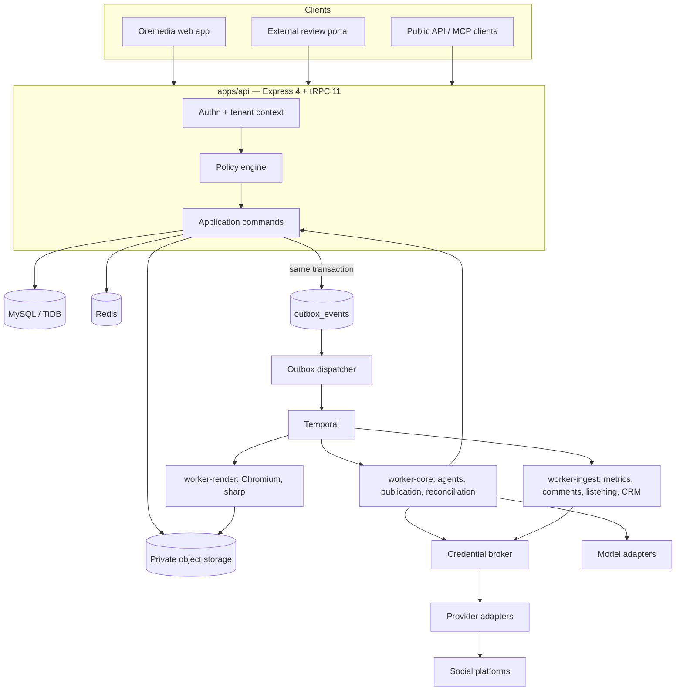

# Oremedia: Build Prompt

**Document type:** implementation prompt and architecture specification for an engineering agent or team.
**Prepared:** 23 September 2026.
**Derived from:** the Postiz architecture study (repository `omichaeln/postiz-app`, commit `4c33d525a6ee66ec06b04bb55b1d259911a12669`) and the brand-intelligence extension that followed it.
**Status:** specification. Nothing described here has been built. Every Postiz observation cited below was re-checked against source at the pinned commit; nothing was runtime-tested.

---

## 0. How to use this prompt

You are building **Oremedia**: a multi-company brand studio and social publishing platform, operated jointly by people and bounded AI agents, that turns approved brand knowledge into editable creative work, governed publication, measured outcomes and retained learning.

Read this whole document before writing code. Then execute the phases in section 22 in order. Each phase has an acceptance gate. Do not start a phase until the previous gate is demonstrably met, and report gate status as **verified** (with how), **open** (with the risk), or **not applicable** (with why). "It should work" is not a status.

### 0.1 Operating rules for the implementing agent

1. **Classify before you build.** General application features are *production-service* tier. Tenant isolation, identity, credentials, delegated authority (approvals, mandates, agent permissions), spend control and irreversible publication are *critical* tier and carry the extra controls in section 18.
2. **The labels in this document are binding.**
   - **Mandatory baseline**: required. Do not ship without it. Do not trade it for speed.
   - **Recommended default**: build it this way unless you record a measured reason not to, in an ADR.
   - **Context-dependent**: build only after the named decision or measurement exists.
   - **Prohibited**: never build, never merge, never "temporarily" allow.
3. **One way of doing each thing.** When a pattern is defined here (scoped repository, error envelope, idempotency, outbox, operation batch, capability register), every module uses it. A second way of doing the same thing is a defect.
4. **Contracts before implementations.** For every module: Zod schemas and TypeScript types first, then the tRPC router or worker interface, then tests, then the implementation.
5. **Small, reviewable commits** on short-lived branches. Main is always releasable.
6. **Stop and escalate** (section 24) at irreversible forks: licence adoption, data deletion semantics, public API commitments, vendor lock-in, spending commitments, and any product policy this document leaves open. Prepare the decision, state it, and stop. Do not guess through it.
7. **Postiz is a reference, not a dependency.** Section 20 states exactly what to port as a *pattern*, what may be ported as *code* (only if ADR-06 accepts the AGPL route), and what must not be copied.
8. **Never fabricate verification.** If you did not run it, say so.

### 0.2 What "done" means for the whole programme

Oremedia is releasable to a controlled client pilot when: two isolated companies with multiple brands can each run the vertical slice (brief → approved assets → editable design and copy → exact-revision approval → scheduled publication on at least one certified channel → confirmed remote outcome → metric snapshot → recommendation), adversarial cross-tenant tests pass on every entry point, unknown publication outcomes are reconciled rather than blindly retried, and the runbooks in section 17 have each been exercised once.

---

## 1. Product definition

### 1.1 The central object

The central object is a **brand-scoped content package**: a brief, one or more editable creative documents, copy, channel variants, the brand version it was built against, the evidence behind its claims, and its review and publication history. A published post is one *outcome* of a package, not the package itself.

The organising loop, which every module serves:

```
Observe → interpret → propose → create → test → measure → update the brand's playbook
```

An insight must lead directly to an actionable brief, an editable creative variant, an experiment, or a community/customer-service action, with its evidence attached.

### 1.2 Actors

| Actor | Description |
|---|---|
| Company owner/admin | Runs a tenant: memberships, billing, policy, connected accounts |
| Brand manager | Owns brand standards, briefs, campaigns, review assignment |
| Creator/designer | Drafts copy and designs; proposes assets |
| Reviewer/client approver | Comments on and approves exact revisions (may be external to the company) |
| Publisher | Schedules or releases approved work to assigned channels |
| Analyst | Reads metrics, runs experiments, proposes changes |
| Community manager | Works the inbox, responds, escalates |
| Agency operator | Sees an authorised portfolio across several client companies |
| Agent (service principal) | Performs bounded tasks under explicit grants, budgets and policy |
| Platform operator | Oremedia staff; separate audited support path, never silent impersonation |

### 1.3 Release scope

| Scope | Release 1 (pilot) | Later, gated |
|---|---|---|
| Tenancy | Companies, brands, memberships, grants, portfolio view | Holding-company relationships, cross-company asset transfer |
| Brand | Versioned brand systems, approved facts, tokens, logo rules, voice | Automated brand extraction at scale, multilingual voice models |
| Assets | Upload, rights, versions, derivatives, eligibility-filtered search | Semantic/visual search, DAM connectors |
| Creative | Static graphics and carousels on a layered canvas; typed agent operations; revisions; exports | Real-time co-editing (CRDT), video editing, HTML collateral |
| Agents | Planner, copywriter, designer, reviewer, analyst roles in Assist and Create modes | Managed autopublish; executable skills |
| Review | Exact-revision approvals, external reviewer links, comments anchored to elements | Multi-stage legal/compliance chains |
| Publishing | 3 to 5 certified channels (decision D-04), outbox, unknown-outcome reconciliation | Remaining provider catalogue |
| Intelligence | Metric snapshots, brand analyst, creative performance library, customer-question clustering, recommendations | Listening, CRM attribution, forecasting, paid-organic planning |
| Experiments | Structured organic comparisons; randomised tests on owned destinations (link landing pages) | Platform-native randomised tests via ad APIs |
| Community | Read-only comment ingestion feeding the customer-voice library | Unified inbox with drafting and assignment |
| Out of scope | Paid ad buying, influencer payments, marketplace/payouts (Postiz marketplace models are not carried forward) | — |

---

## 2. Non-negotiables

### 2.1 Mandatory baseline (summary; each is specified in detail later)

1. Every tenant-owned row carries `tenant_id`; every brand-owned row carries `brand_id`. Tenant scoping is enforced by construction in the data-access layer (section 5.3). A query without tenant context fails loudly.
2. Server-side, resource-level authorisation on every entry point: UI, tRPC, public REST, MCP, agent tools, workers, admin tooling, exports.
3. Agents never choose their tenant or brand, never see raw credentials, never approve their own output outside a configured mandate, and never exceed a pre-reserved budget.
4. Approval binds to content hashes (text, export files, settings, channels, timing window, brand and policy version). Any material change invalidates it. Authority, rights and approval are re-checked at dispatch.
5. Schedules are written with an outbox event in the same transaction. Dispatch is idempotent on a stable occurrence ID.
6. `outcome_unknown` is a first-class publication state. Ambiguous mutations are reconciled against the platform, or held for a human. They are never retried blindly.
7. Social credentials are envelope-encrypted, referenced by ID, resolved only inside the publishing worker, and never placed in workflow payloads, prompts, events or logs.
8. Editable design documents are persisted separately from rendered exports. Approved exports are immutable and are what gets published.
9. Every metric carries source, fetch time, window, definition version and completeness. Missing is not zero.
10. Every recommendation and learning record carries its evidence, and "observed association" is distinguished from "experimentally supported".
11. Schema changes are versioned expand/contract migrations. No schema push with data loss acceptance, ever.
12. CI runs format, lint, typecheck, unit, integration (real database), cross-tenant, workflow-replay and dependency scans on every PR.

### 2.2 Prohibited

- Prompt-only approval or confirmation as a control.
- Optional tenant filters, raw database handles in feature code, or upserts keyed on caller-supplied IDs without tenant predicates (see Postiz R1, section 20.4).
- Fire-and-forget scheduling (DB write, then an unawaited, error-swallowing workflow start).
- Retrying a non-idempotent provider mutation after an ambiguous failure, including an HTTP 5xx or a heartbeat timeout.
- Terminating an in-flight publish workflow as a way to "update" a post.
- Provider-specific branches in generic code (`if (provider === 'x')`). Behaviour differences live in the provider adapter and its capability definition.
- Arbitrary uploaded executable code in skills (Release 1).
- Silently pooling one company's content, audience data or learning into another company's context.
- Engagement gains automatically rewriting approved brand standards.
- Generating approximations of logos. Logos are always approved original asset files.
- Regenerating creative after approval.
- `dangerouslySetInnerHTML` on user, agent or provider content without a sanitiser; arbitrary HTML/JS in the canvas schema.

---

## 3. Technology stack

### 3.1 Decision

Oremedia uses the **PointFive OS stack**, extended only where a requirement demands it.

| Layer | Choice | Label |
|---|---|---|
| Language | TypeScript 5.x, `strict: true`, `noUncheckedIndexedAccess: true` | Mandatory baseline |
| Runtime | Node 22 LTS | Recommended default |
| Package manager / workspace | pnpm workspaces + Turborepo | Recommended default |
| Frontend | React 19, Vite, React Router 7 (library/data mode), TanStack Query via `@trpc/tanstack-react-query` | Recommended default |
| Styling | Tailwind CSS 4 with CSS custom-property tokens; Radix primitives for accessible behaviour | Recommended default |
| API | Express 4 + tRPC 11 (`@trpc/server/adapters/express`) for the application API | Mandatory (stack) |
| Public API | REST generated from the same Zod contracts (`trpc-to-openapi` or hand-written Express routes delegating to the same application commands) | Recommended default |
| Validation | Zod 3 schemas as the single source of contract truth | Mandatory baseline |
| ORM | Drizzle ORM + drizzle-kit migrations | Mandatory (stack) |
| System of record | MySQL 8.0+ (InnoDB) or TiDB 8.5 LTS+ (decision D-01) | Mandatory (stack) |
| Durable workflows | Temporal (TypeScript SDK 1.x). Temporal Cloud recommended; if self-hosted, its persistence runs on its own MySQL 8 or PostgreSQL cluster, never on the application TiDB | Mandatory baseline |
| Cache / coordination | Redis 7 (rate limiting, short-lived locks, presence, SWR-style caches). Never the durable record | Recommended default |
| Object storage | S3-compatible (AWS S3 or Cloudflare R2), private buckets, presigned access | Recommended default |
| Canvas | Konva + react-konva behind an editor-neutral document model (section 11.6) | Recommended default |
| Rendering | Isolated render workers running headless Chromium (Playwright) against a render-only bundle of the same Konva renderer | Recommended default |
| Image processing | `sharp`; `ffmpeg` only when video enters scope | Recommended default |
| Authentication | OIDC-capable, maintained library. Reuse PointFive OS identity if it exists; otherwise Better Auth (Drizzle adapter) for authn only. Authorisation is Oremedia's own policy layer | Recommended default |
| LLM access | Provider-agnostic `ModelAdapter`; Anthropic as default provider (`claude-sonnet-5` for drafting and tool use, `claude-opus-5-5` for planning and review, `claude-haiku-4-5-20251001` for classification and clustering) via the official SDK. Model IDs are configuration, not code | Recommended default |
| Image generation | Pluggable `ImageGenerationAdapter`; provider chosen by decision D-06 | Context-dependent |
| Observability | OpenTelemetry traces/metrics/logs; Sentry for errors; structured JSON logs via pino with field allowlists | Mandatory baseline |
| Secrets | Cloud secret manager + KMS for envelope encryption | Mandatory baseline |

### 3.2 Where this deviates from the Postiz study, and why

The earlier study recommended NestJS, PostgreSQL and Next.js as the target stack. That recommendation was written from the Postiz baseline. Oremedia follows the PointFive OS stack instead, because nothing in the requirements needs NestJS, Postgres or server-side rendering: tRPC 11 on Express covers the application API, Drizzle covers persistence, and the studio is an authenticated single-page application.

The genuine cost is **PostgreSQL row-level security**, which the study listed as a recommended defence-in-depth layer. MySQL and TiDB have no equivalent. The mitigation is structural and mandatory: the scoped repository (section 5.3), a lint rule banning raw database access outside `packages/db`, composite tenant keys, and a CI suite that attempts cross-tenant access on every entry point. If an ADR later demands database-enforced RLS as a hard control, that is the one requirement that would overturn the MySQL/TiDB choice, and it should be raised explicitly rather than approximated.

Two engine-specific notes the implementing agent must respect:

- **TiDB foreign keys.** Enforced foreign keys exist on recent TiDB versions but must be verified on the exact target version and cluster configuration. If they are not enforced, composite-integrity checks become (a) repository-level assertions and (b) a scheduled integrity-verification job that alerts on any orphan or cross-tenant reference. MySQL 8 InnoDB enforces them natively.
- **TiDB write hotspots.** Time-ordered primary keys on a clustered index concentrate writes on one region. High-write tables (outbox, publication attempts, metric snapshots, audit events, tool invocations) use `NONCLUSTERED` primary keys with `SHARD_ROW_ID_BITS`, applied in the generated migration SQL. On MySQL this is a no-op concern.

### 3.3 Repository layout

```
oremedia/
├── apps/
│   ├── web/                    # React 19 + Vite SPA (studio, portfolio, review, intelligence)
│   ├── api/                    # Express 4 + tRPC 11: application API, public REST, OAuth callbacks, MCP
│   ├── worker-core/            # Temporal worker: planning, agent runs, outbox dispatch, publication, reconciliation
│   ├── worker-render/          # Temporal worker: isolated rendering and media derivatives (Chromium, sharp)
│   ├── worker-ingest/          # Temporal worker: metric collection, comment ingestion, listening, CRM sync
│   └── review-portal/          # (optional split) external reviewer surface; same web build, separate origin
├── packages/
│   ├── contracts/              # Zod schemas, DTO types, error codes, event schemas (no runtime deps beyond zod)
│   ├── db/                     # Drizzle schema, migrations, scoped repository base, tenant context
│   ├── domain/                 # Pure domain logic per module (state machines, policy, hashing, statistics)
│   ├── modules/                # Application services per bounded context (see section 4)
│   │   ├── access/
│   │   ├── brand/
│   │   ├── assets/
│   │   ├── creative/
│   │   ├── content/
│   │   ├── review/
│   │   ├── skills/
│   │   ├── agents/
│   │   ├── publishing/
│   │   ├── measurement/
│   │   ├── intelligence/
│   │   ├── experiments/
│   │   ├── community/
│   │   ├── billing/
│   │   └── operations/
│   ├── providers/              # Social provider adapters + capability register (ported pattern from Postiz)
│   ├── editor/                 # Document model, operation engine, Konva renderer, editor adapter
│   ├── workflows/              # Temporal workflow definitions (deterministic code only)
│   ├── activities/             # Temporal activity implementations (thin; call modules)
│   ├── ai/                     # ModelAdapter, tool dispatcher, context resolver, evaluation harness
│   ├── ui/                     # Shared React components and design tokens
│   └── observability/          # Logger, tracer, metrics, redaction allowlists
├── tooling/
│   ├── eslint-config/          # Includes custom rules (section 5.4)
│   └── test-fixtures/          # Brand fixtures, golden renders, provider response fixtures
├── docs/
│   ├── adr/
│   ├── runbooks/
│   └── contracts/              # Generated OpenAPI, event catalogue, tool catalogue
└── infra/                      # IaC, container definitions, Temporal namespace config
```

**Dependency rule (mandatory, enforced by `eslint-plugin-boundaries` or `dependency-cruiser` in CI):**

```
apps/*        → modules, contracts, observability, ui (web only)
workflows     → contracts only (plus @temporalio/workflow). No I/O, no DB, no Node APIs. Time and randomness only through
                the Temporal sandbox's deterministic Date/Math.random or workflow APIs (sleep, condition, uuid4).
activities    → modules, providers, contracts
modules/X     → domain, db, contracts, and the *public index* of other modules. Never another module's tables.
providers     → contracts, observability. No DB access; credentials are passed in by the broker.
domain        → contracts only. Pure functions.
```

---

## 4. System architecture

### 4.1 Shape

A **modular monolith** for the application API, plus **three independently scalable Temporal worker pools**. No microservices. A module is split into its own deployable only when it has a measured need for independent scaling or deployment cadence and an owner able to run it (ADR-01).



### 4.2 Bounded contexts

Each module owns its tables and writes. Other modules call its public service interface, never its repositories.

| Module | Owns (tables) | Public capability | Tier |
|---|---|---|---|
| `access` | tenants, users, memberships, brand_grants, service_principals, api_clients, sessions, external_reviewer_links | `authorize(actor, action, resource)`; membership resolution | Critical |
| `brand` | brands, brand_versions, design_tokens, approved_facts, voice_rules, logo_rules, policy_versions, brand_objectives | `resolveBrandSnapshot(brandId, versionId?)` | Production |
| `assets` | assets, asset_versions, asset_derivatives, usage_rights, asset_grants, collections, asset_usages | `findEligibleAssets(query, purpose)`; `authoriseUse(assetVersionId, purpose)` | Production (rights: critical) |
| `creative` | creative_documents, creative_revisions, element_comments, templates, template_versions, render_jobs, rendered_exports | `applyOperations(docId, baseRevision, ops)`; `requestRender(revisionId)` | Production |
| `content` | campaigns, briefs, content_packages, content_revisions, channel_variants, creative_attributes | Plan, adapt, calendar | Production |
| `review` | review_requests, review_decisions, release_approvals, publishing_mandates | `evaluateRelease(packageRevisionId, target)` | Critical |
| `skills` | skills, skill_versions, skill_bindings, evaluation_suites, evaluation_results | `resolveSkills(brandId, task)` | Production |
| `agents` | agent_runs, agent_steps, tool_invocations, budget_reservations | `startRun(brief)`; tool dispatch | Critical (authority, spend) |
| `publishing` | channel_connections, credential_refs, publications, publication_attempts, remote_evidence, provider_capabilities | `schedule(approvedPackage)`; reconcile | Critical |
| `measurement` | metric_definitions, metric_snapshots, link_tracking, conversions | Collect, normalise, freshness | Production |
| `intelligence` | insights, recommendations, learning_records, playbook_entries, customer_voice_clusters, listening_sources, anomalies | Analyst outputs and playbook | Production |
| `experiments` | experiments, experiment_variants, experiment_assignments, experiment_results | Design, run, analyse | Production |
| `community` | conversations, messages, assignments, response_drafts | Inbox (Release 2) | Production |
| `billing` | plans, entitlements, subscriptions, usage_ledger, spend_limits | `checkEntitlement`, `reserveSpend` | Critical (money) |
| `operations` | audit_events, outbox_events, idempotency_keys, deletion_requests, retention_policies, incidents | Audit, outbox, idempotency, retention | Critical |

### 4.3 Request path (every mutating call)

```
HTTP → authn (session or API client or OAuth token)
     → resolve actor + tenant context (server-established; never from body)
     → rate limit (per principal, per tenant)
     → Zod input validation
     → idempotency lookup (mutations)
     → policy.authorize(actor, action, resource)   ← resource loaded through scoped repository
     → application command (transaction: writes + audit_event + outbox_event)
     → response envelope with correlation ID
```

### 4.4 Worker topology

| Worker | Task queues | Why separate |
|---|---|---|
| `worker-core` | `core`, `agents`, `publish-{provider}` (one queue per provider, so a slow or rate-limited provider cannot starve others) | Authority-bearing work; holds credential-broker access |
| `worker-render` | `render`, `media` | CPU/memory heavy; runs untrusted-input parsers; no credential access; restricted egress |
| `worker-ingest` | `ingest-metrics`, `ingest-comments`, `listening`, `crm` | Scheduled pulls with provider rate limits; must never starve publishing |

The per-provider publish queue is a direct port of the Postiz pattern (`libraries/nestjs-libraries/src/temporal/temporal.module.ts` builds provider-specific activity queues). Keep it.

---

## 5. Tenancy, identity and authorisation

### 5.1 Ownership model (ADR-02)

`Company` = **tenant** = security boundary. A company owns one or more `Brand`s. A user may hold memberships in many companies with different roles in each. A billing account may pay for several companies without gaining data access. An agency portfolio is a *projection* over the operator's memberships, never a shared container.

```
User ─< Membership >─ Tenant(Company)
                        ├─< Brand ─< BrandVersion
                        │       ├─< Asset, CreativeDocument, Campaign, ContentPackage
                        │       ├─< ChannelConnection, PublishingMandate
                        │       └─< Experiment, Recommendation, PlaybookEntry
                        └─< ServicePrincipal (agents, API clients)
```

Cross-brand reuse inside one tenant requires an `asset_grant` or a reviewed copy. Cross-tenant sharing is a copy into the receiving tenant with provenance, never a shared mutable row.

### 5.2 Tenant context

```ts
// packages/db/src/tenant-context.ts
import { AsyncLocalStorage } from 'node:async_hooks';

export type ActorKind = 'user' | 'service_principal' | 'external_reviewer' | 'platform_operator';

export interface TenantContext {
  readonly tenantId: string;
  readonly actor: { kind: ActorKind; id: string };
  readonly brandIds: ReadonlySet<string> | 'all';   // brands this actor may touch in this tenant
  readonly correlationId: string;
  readonly supportSessionId?: string;              // set only on audited platform-operator access
}

const storage = new AsyncLocalStorage<TenantContext>();

export const runInTenant = <T>(ctx: TenantContext, fn: () => Promise<T>) => storage.run(ctx, fn);

export function requireTenant(): TenantContext {
  const ctx = storage.getStore();
  if (!ctx) {
    // Loud by design: a missing tenant context is a bug, never a fallback to "all rows".
    throw new TenantContextMissingError();
  }
  return ctx;
}

export class TenantContextMissingError extends Error {
  readonly code = 'TENANT_CONTEXT_MISSING';
}
```

Workers do not inherit HTTP context. Every activity input carries `tenantId` and `actorRef`, and the activity wraps its body in `runInTenant(...)` after re-loading the actor's current grants. A workflow never trusts a tenant or permission captured hours earlier for an authority decision; it re-checks at the point of effect.

### 5.3 Scoped repository (mandatory baseline)

Feature code never touches the raw Drizzle handle. It extends `TenantScopedRepository`, which injects the tenant predicate into every read, update and delete and stamps `tenant_id` on every insert.

```ts
// packages/db/src/scoped-repository.ts
import { and, eq, type SQL } from 'drizzle-orm';
import type { MySqlTable, MySqlColumn } from 'drizzle-orm/mysql-core';
import { db, type Tx } from './client';
import { requireTenant } from './tenant-context';

type TenantTable = MySqlTable & { tenantId: MySqlColumn; id: MySqlColumn };

export abstract class TenantScopedRepository<T extends TenantTable> {
  protected constructor(protected readonly table: T) {}

  /** Every query starts here. There is no unscoped variant. */
  protected scope(extra?: SQL): SQL {
    const { tenantId } = requireTenant();
    const tenantClause = eq(this.table.tenantId, tenantId);
    return extra ? and(tenantClause, extra)! : tenantClause;
  }

  protected conn(tx?: Tx) {
    return tx ?? db;
  }

  async findById(id: string, tx?: Tx) {
    const rows = await this.conn(tx)
      .select()
      .from(this.table)
      .where(this.scope(eq(this.table.id, id)))
      .limit(1);
    return rows[0] ?? null;
  }

  /** Throws NOT_FOUND for ids that exist in another tenant: never reveal existence. */
  async getById(id: string, tx?: Tx) {
    const row = await this.findById(id, tx);
    if (!row) throw new NotFoundError(this.constructor.name, id);
    return row;
  }

  protected async insertScoped(values: Omit<T['$inferInsert'], 'tenantId'>, tx?: Tx) {
    const { tenantId } = requireTenant();
    await this.conn(tx).insert(this.table).values({ ...values, tenantId } as T['$inferInsert']);
  }

  /** Updates are always id + tenant + expected version (optimistic concurrency). */
  protected async updateScoped(
    id: string,
    expectedVersion: number,
    values: Partial<T['$inferInsert']>,
    tx?: Tx,
  ) {
    const res = await this.conn(tx)
      .update(this.table)
      .set({ ...values, version: expectedVersion + 1 } as never)
      .where(this.scope(and(eq(this.table.id, id), eq((this.table as any).version, expectedVersion))));
    if (res[0].affectedRows !== 1) throw new ConflictError(this.constructor.name, id, expectedVersion);
  }
}
```

Rules:

- **Create and update are separate commands.** No upsert keyed on a client-supplied ID. (Direct response to Postiz R1.)
- Any ID arriving from a client is loaded through a scoped repository before use. A foreign ID produces `NOT_FOUND`, not `FORBIDDEN`, so existence is not leaked.
- Brand-owned repositories extend `BrandScopedRepository`, which additionally requires `brandId ∈ ctx.brandIds`.
- Cross-tenant jobs (billing roll-ups, platform metrics) use a separate `PlatformRepository` available only in `operations`, reading aggregate projections, audited, and never returning tenant content.

### 5.4 Enforcement in tooling (mandatory baseline)

1. ESLint rule `oremedia/no-raw-db`: importing `packages/db/src/client` is an error outside `packages/db`.
2. ESLint rule `oremedia/no-provider-branching`: flags string comparisons against provider identifiers outside `packages/providers`.
3. CI schema check: every table in `packages/db/src/schema` either has a `tenantId` column or is listed in `GLOBAL_TABLES` with a written justification.
4. Cross-tenant test harness (section 19.3) runs every tRPC procedure, REST route, MCP tool and agent tool with a second tenant's IDs.

### 5.5 Authorisation policy

One auditable function decides. Everything calls it.

```ts
// packages/modules/access/src/policy.ts
export type Action =
  | 'brand.read' | 'brand.edit_standards' | 'brand.publish_version'
  | 'asset.read' | 'asset.upload' | 'asset.approve' | 'asset.manage_rights'
  | 'creative.read' | 'creative.edit' | 'creative.render'
  | 'content.plan' | 'content.edit'
  | 'review.request' | 'review.decide'
  | 'publication.schedule' | 'publication.cancel' | 'publication.delete_remote'
  | 'channel.connect' | 'channel.manage'
  | 'mandate.manage'
  | 'agent.start_run' | 'agent.cancel_run'
  | 'skill.author' | 'skill.publish'
  | 'insight.read' | 'experiment.manage' | 'playbook.approve'
  | 'inbox.respond'
  | 'billing.manage' | 'membership.manage' | 'audit.read';

export interface Decision {
  allowed: boolean;
  reason: string;              // machine-readable, e.g. 'role_missing', 'brand_not_granted', 'entitlement_exceeded'
  obligations?: Obligation[];  // e.g. { type: 'requires_approval', scope: ... }
}

export interface PolicyInput {
  actor: ResolvedActor;        // memberships, roles, brand grants, service-principal grants
  action: Action;
  resource: { type: string; tenantId: string; brandId?: string; channelId?: string; state?: string };
  context: { autonomyMode?: AutonomyMode; entitlements: EntitlementSet; now: Date };
}

export function authorize(input: PolicyInput): Decision {
  // Order matters and is tested:
  // 1. tenant match   2. membership active   3. brand grant   4. role/permission
  // 5. resource state (e.g. cannot edit an approved revision)   6. entitlement
  // 7. service-principal grant ∩ autonomy mode   8. obligations (approval, two-person rule)
  ...
}
```

Default role grants (recommended default; tenants may customise within these bounds):

| Action group | Owner/Admin | Brand manager | Creator | Reviewer | Publisher | Analyst | Community | Agent |
|---|---|---|---|---|---|---|---|---|
| Brand standards edit/publish | Yes | Yes | — | — | — | — | — | Propose only |
| Assets upload | Yes | Yes | Yes | — | — | — | — | Propose (generated) |
| Asset approve / rights | Yes | Yes | — | — | — | — | — | — |
| Creative edit / render | Yes | Yes | Yes | — | — | — | — | Yes (grant) |
| Review decide | Yes | Yes | — | Yes | — | — | — | Never |
| Publication schedule/cancel | Yes | Yes | — | — | Yes | — | — | Only under mandate |
| Channel connect | Yes | — | — | — | Yes | — | — | Never |
| Delete remote post | Yes | — | — | — | Yes | — | — | Never |
| Experiments manage | Yes | Yes | — | — | — | Yes | — | Propose only |
| Playbook approve | Yes | Yes | — | — | — | — | — | Never |
| Inbox respond | Yes | Yes | — | — | — | — | Yes | Draft only |
| Billing / memberships | Yes | — | — | — | — | — | — | Never |

Separation of duties is **context-dependent**: a tenant may require the approver and the creator of a revision to be different principals (`policy_versions.require_distinct_approver`). An agent is never the approver.

### 5.6 External reviewers

Client approvers without accounts receive a **review link**: a single-use-per-session, expiring, revocable token bound to one `review_request`, served on a separate origin (`review.oremedia...`). The link grants `review.decide` on that request only. Decisions record the reviewer's verified email (magic-link confirmation) and IP/user-agent hash. Revocation takes effect on the next request.

### 5.7 Platform operator access

No silent impersonation (Postiz implements privileged impersonation in its auth middleware; do not port that as-is). Operators open a **support session**: reason, ticket reference, tenant consent flag where contractually required, time-boxed (default 60 minutes), read-only unless escalated with a second operator, every request audited with `supportSessionId`.

---

## 6. Data model

### 6.1 Conventions (mandatory baseline)

- **IDs:** prefixed ULIDs, `varchar(32)`, generated in application code. Prefixes make ID mix-ups visible in logs and tests: `ten_`, `usr_`, `brd_`, `bv_`, `ast_`, `av_`, `doc_`, `rev_`, `exp_` (export), `pkg_`, `pr_` (package revision), `rr_` (review request), `apr_`, `pub_`, `att_`, `run_`, `evt_`, `xp_` (experiment), `rec_`, `lrn_`.
- **Timestamps:** `datetime(3)` in UTC. Zones are presentation; each brand stores its IANA zone for scheduling.
- **Money and cost:** integer micro-units (`bigint`, USD micro-dollars) plus currency code. Never floats.
- **Versioning:** mutable aggregates carry `version int not null default 0` for optimistic concurrency.
- **Immutability:** revisions, exports, approvals, decisions, attempts, evidence, metric snapshots, usage ledger and audit events are insert-only. Enforced by repository API (no update methods) and by a DB user without `UPDATE`/`DELETE` grants on those tables for the application role where the engine permits.
- **Hashes:** SHA-256 hex, `char(64)`.
- **JSON columns** hold versioned documents validated by Zod on read and write (`schema_version` field inside the JSON). JSON is never queried for tenancy or authorisation.
- **Soft delete** is not a default. Lifecycle states (`retired`, `superseded`, `archived`) and deletion requests (section 17.5) are explicit.
- **Composite integrity:** child rows referencing a brand-owned parent carry the same `(tenant_id, brand_id)` and reference the parent by `(tenant_id, brand_id, id)` so a design cannot point at another brand's asset.

### 6.2 Core Drizzle schema (representative; complete the catalogue in 6.3 following the same pattern)

```ts
// packages/db/src/schema/_columns.ts
import { varchar, datetime, int } from 'drizzle-orm/mysql-core';
export const id = (name = 'id') => varchar(name, { length: 32 }).primaryKey();
export const ref = (name: string) => varchar(name, { length: 32 });
export const tenantId = () => varchar('tenant_id', { length: 32 }).notNull();
export const brandId = () => varchar('brand_id', { length: 32 }).notNull();
export const createdAt = () => datetime('created_at', { fsp: 3 }).notNull().$defaultFn(() => new Date());
export const updatedAt = () => datetime('updated_at', { fsp: 3 }).notNull().$defaultFn(() => new Date());
export const version = () => int('version').notNull().default(0);
```

```ts
// packages/db/src/schema/access.ts
import { mysqlTable, varchar, mysqlEnum, boolean, uniqueIndex, index, json } from 'drizzle-orm/mysql-core';
import { id, ref, tenantId, createdAt, updatedAt, version } from './_columns';

export const tenants = mysqlTable('tenants', {
  id: id(),
  name: varchar('name', { length: 200 }).notNull(),
  slug: varchar('slug', { length: 80 }).notNull(),
  billingAccountId: ref('billing_account_id'),
  dataRegion: varchar('data_region', { length: 16 }).notNull().default('default'),
  status: mysqlEnum('status', ['active', 'suspended', 'closing']).notNull().default('active'),
  createdAt: createdAt(), updatedAt: updatedAt(), version: version(),
}, (t) => [uniqueIndex('uq_tenants_slug').on(t.slug)]);

export const memberships = mysqlTable('memberships', {
  id: id(),
  tenantId: tenantId(),
  userId: ref('user_id').notNull(),
  role: mysqlEnum('role', ['owner', 'admin', 'brand_manager', 'creator', 'reviewer', 'publisher', 'analyst', 'community']).notNull(),
  status: mysqlEnum('status', ['invited', 'active', 'disabled']).notNull(),
  allBrands: boolean('all_brands').notNull().default(false),
  createdAt: createdAt(), updatedAt: updatedAt(), version: version(),
}, (t) => [
  uniqueIndex('uq_membership').on(t.tenantId, t.userId),
  index('ix_membership_user').on(t.userId),
]);

export const brandGrants = mysqlTable('brand_grants', {
  id: id(),
  tenantId: tenantId(),
  membershipId: ref('membership_id').notNull(),
  brandId: ref('brand_id').notNull(),
  roles: json('roles').$type<string[]>().notNull(),     // additional per-brand roles
  createdAt: createdAt(),
}, (t) => [uniqueIndex('uq_brand_grant').on(t.tenantId, t.membershipId, t.brandId)]);

export const servicePrincipals = mysqlTable('service_principals', {
  id: id(),
  tenantId: tenantId(),
  kind: mysqlEnum('kind', ['agent', 'api_client', 'mcp_client', 'integration']).notNull(),
  name: varchar('name', { length: 120 }).notNull(),
  grants: json('grants').$type<ServicePrincipalGrant[]>().notNull(),   // action + brand + channel scope
  maxAutonomy: mysqlEnum('max_autonomy', ['assist', 'create', 'prepare_release', 'managed_autopublish']).notNull().default('create'),
  status: mysqlEnum('status', ['active', 'revoked']).notNull(),
  createdByUserId: ref('created_by_user_id').notNull(),
  createdAt: createdAt(), updatedAt: updatedAt(), version: version(),
});
```

```ts
// packages/db/src/schema/brand.ts
export const brands = mysqlTable('brands', {
  id: id(), tenantId: tenantId(),
  name: varchar('name', { length: 200 }).notNull(),
  timezone: varchar('timezone', { length: 64 }).notNull(),
  defaultLocale: varchar('default_locale', { length: 16 }).notNull(),
  publishedVersionId: ref('published_version_id'),
  status: mysqlEnum('status', ['setup', 'active', 'archived']).notNull(),
  createdAt: createdAt(), updatedAt: updatedAt(), version: version(),
}, (t) => [uniqueIndex('uq_brand_tenant_id').on(t.tenantId, t.id)]);

export const brandVersions = mysqlTable('brand_versions', {
  id: id(), tenantId: tenantId(), brandId: brandId(),
  number: int('number').notNull(),
  state: mysqlEnum('state', ['draft', 'in_review', 'published', 'retired']).notNull(),
  document: json('document').$type<BrandSystemDocumentV1>().notNull(),   // tokens, voice, logo rules, patterns, channel guidance
  contentHash: char('content_hash', { length: 64 }).notNull(),
  publishedAt: datetime('published_at', { fsp: 3 }),
  publishedByUserId: ref('published_by_user_id'),
  createdAt: createdAt(),
}, (t) => [uniqueIndex('uq_brand_version_number').on(t.tenantId, t.brandId, t.number)]);

export const approvedFacts = mysqlTable('approved_facts', {
  id: id(), tenantId: tenantId(), brandId: brandId(),
  kind: mysqlEnum('kind', ['product', 'claim', 'offer', 'contact', 'price', 'statistic', 'legal']).notNull(),
  statement: text('statement').notNull(),
  evidence: json('evidence').$type<EvidenceRef[]>().notNull(),   // source doc/asset refs, URLs, reviewer
  validFrom: datetime('valid_from', { fsp: 3 }),
  validUntil: datetime('valid_until', { fsp: 3 }),                // expired offers block release
  state: mysqlEnum('state', ['proposed', 'approved', 'revoked']).notNull(),
  createdAt: createdAt(), updatedAt: updatedAt(), version: version(),
});

export const brandObjectives = mysqlTable('brand_objectives', {
  id: id(), tenantId: tenantId(), brandId: brandId(),
  name: varchar('name', { length: 160 }).notNull(),
  primaryMetricKey: varchar('primary_metric_key', { length: 80 }).notNull(),   // e.g. 'qualified_enquiries'
  guardrailMetricKeys: json('guardrail_metric_keys').$type<string[]>().notNull(),
  activeFrom: datetime('active_from', { fsp: 3 }).notNull(),
  activeUntil: datetime('active_until', { fsp: 3 }),
  createdAt: createdAt(),
});
```

```ts
// packages/db/src/schema/creative.ts
export const creativeDocuments = mysqlTable('creative_documents', {
  id: id(), tenantId: tenantId(), brandId: brandId(),
  contentPackageId: ref('content_package_id'),
  title: varchar('title', { length: 200 }).notNull(),
  currentRevisionId: ref('current_revision_id'),
  schemaVersion: int('schema_version').notNull(),
  createdAt: createdAt(), updatedAt: updatedAt(), version: version(),
});

export const creativeRevisions = mysqlTable('creative_revisions', {
  id: id(), tenantId: tenantId(), brandId: brandId(),
  documentId: ref('document_id').notNull(),
  parentRevisionId: ref('parent_revision_id'),
  number: int('number').notNull(),
  brandVersionId: ref('brand_version_id').notNull(),
  agentRunId: ref('agent_run_id'),
  authorKind: mysqlEnum('author_kind', ['user', 'agent']).notNull(),
  authorId: ref('author_id').notNull(),
  changeSummary: varchar('change_summary', { length: 500 }).notNull(),
  operations: json('operations').$type<OperationBatch>().notNull(),     // what changed from parent
  snapshot: json('snapshot').$type<CreativeDocumentV1>().notNull(),     // full document at this revision
  contentHash: char('content_hash', { length: 64 }).notNull(),
  createdAt: createdAt(),
}, (t) => [uniqueIndex('uq_rev_number').on(t.tenantId, t.documentId, t.number)]);

export const renderedExports = mysqlTable('rendered_exports', {
  id: id(), tenantId: tenantId(), brandId: brandId(),
  revisionId: ref('revision_id').notNull(),
  pageId: varchar('page_id', { length: 40 }).notNull(),
  formatKey: varchar('format_key', { length: 40 }).notNull(),   // 'ig_feed_4x5', 'li_1200x627', ...
  mime: varchar('mime', { length: 40 }).notNull(),
  width: int('width').notNull(), height: int('height').notNull(),
  bytes: bigint('bytes', { mode: 'number' }).notNull(),
  storageKey: varchar('storage_key', { length: 300 }).notNull(),
  contentHash: char('content_hash', { length: 64 }).notNull(),
  rendererVersion: varchar('renderer_version', { length: 40 }).notNull(),
  manifest: json('manifest').$type<RenderManifest>().notNull(),   // fonts + asset versions + hashes
  validation: json('validation').$type<RenderValidationResult>().notNull(),
  createdAt: createdAt(),
});
```

```ts
// packages/db/src/schema/review.ts
export const releaseApprovals = mysqlTable('release_approvals', {
  id: id(), tenantId: tenantId(), brandId: brandId(),
  contentRevisionId: ref('content_revision_id').notNull(),
  reviewRequestId: ref('review_request_id').notNull(),
  approverKind: mysqlEnum('approver_kind', ['user', 'external_reviewer']).notNull(),
  approverId: ref('approver_id').notNull(),
  bindingHash: char('binding_hash', { length: 64 }).notNull(),     // see section 13.2
  binding: json('binding').$type<ApprovalBindingV1>().notNull(),
  validUntil: datetime('valid_until', { fsp: 3 }),
  state: mysqlEnum('state', ['valid', 'invalidated', 'consumed', 'expired']).notNull(),
  invalidatedReason: varchar('invalidated_reason', { length: 80 }),
  createdAt: createdAt(), version: version(),
});

export const publishingMandates = mysqlTable('publishing_mandates', {
  id: id(), tenantId: tenantId(), brandId: brandId(),
  ownerUserId: ref('owner_user_id').notNull(),
  servicePrincipalId: ref('service_principal_id').notNull(),
  channelConnectionIds: json('channel_connection_ids').$type<string[]>().notNull(),
  allowedContentClasses: json('allowed_content_classes').$type<string[]>().notNull(),
  sourceRules: json('source_rules').$type<MandateSourceRules>().notNull(),   // e.g. only approved facts, only approved templates
  maxPostsPerDay: int('max_posts_per_day').notNull(),
  windowStart: datetime('window_start', { fsp: 3 }).notNull(),
  windowEnd: datetime('window_end', { fsp: 3 }).notNull(),   // mandates always expire
  state: mysqlEnum('state', ['active', 'paused', 'revoked', 'expired']).notNull(),
  createdAt: createdAt(), updatedAt: updatedAt(), version: version(),
});
```

```ts
// packages/db/src/schema/publishing.ts
export const channelConnections = mysqlTable('channel_connections', {
  id: id(), tenantId: tenantId(), brandId: brandId(),
  providerKey: varchar('provider_key', { length: 40 }).notNull(),
  remoteAccountId: varchar('remote_account_id', { length: 200 }).notNull(),
  displayName: varchar('display_name', { length: 200 }).notNull(),
  credentialRefId: ref('credential_ref_id').notNull(),
  grantedScopes: json('granted_scopes').$type<string[]>().notNull(),
  status: mysqlEnum('status', ['active', 'refresh_needed', 'reconnect_needed', 'disabled']).notNull(),
  tokenExpiresAt: datetime('token_expires_at', { fsp: 3 }),
  createdAt: createdAt(), updatedAt: updatedAt(), version: version(),
}, (t) => [uniqueIndex('uq_channel_remote').on(t.tenantId, t.providerKey, t.remoteAccountId)]);

export const credentialRefs = mysqlTable('credential_refs', {
  id: id(), tenantId: tenantId(),
  kmsKeyId: varchar('kms_key_id', { length: 200 }).notNull(),
  wrappedDataKey: varbinary('wrapped_data_key', { length: 512 }).notNull(),
  ciphertext: varbinary('ciphertext', { length: 8192 }).notNull(),   // AES-256-GCM of { accessToken, refreshToken, extra }
  iv: varbinary('iv', { length: 12 }).notNull(),
  authTag: varbinary('auth_tag', { length: 16 }).notNull(),
  aad: varchar('aad', { length: 200 }).notNull(),                   // `${tenantId}:${channelConnectionId}` binds ciphertext to its owner
  rotatedAt: datetime('rotated_at', { fsp: 3 }),
  createdAt: createdAt(), version: version(),
});

export const publications = mysqlTable('publications', {
  id: id(), tenantId: tenantId(), brandId: brandId(),
  contentPackageId: ref('content_package_id').notNull(),
  contentRevisionId: ref('content_revision_id').notNull(),
  channelVariantId: ref('channel_variant_id').notNull(),
  channelConnectionId: ref('channel_connection_id').notNull(),
  occurrenceKey: varchar('occurrence_key', { length: 120 }).notNull(),   // stable dedupe identity
  authority: mysqlEnum('authority', ['approval', 'mandate']).notNull(),
  approvalId: ref('approval_id'),
  mandateId: ref('mandate_id'),
  scheduledFor: datetime('scheduled_for', { fsp: 3 }).notNull(),
  state: mysqlEnum('state', [
    'scheduled', 'dispatching', 'processing', 'published',
    'failed', 'outcome_unknown', 'cancelled', 'held',
  ]).notNull(),
  stateReason: varchar('state_reason', { length: 120 }),
  remotePostId: varchar('remote_post_id', { length: 200 }),
  remoteUrl: varchar('remote_url', { length: 1000 }),
  fencingToken: int('fencing_token').notNull().default(0),
  createdAt: createdAt(), updatedAt: updatedAt(), version: version(),
}, (t) => [
  uniqueIndex('uq_publication_occurrence').on(t.tenantId, t.occurrenceKey),
  index('ix_publication_due').on(t.state, t.scheduledFor),
]);

export const publicationAttempts = mysqlTable('publication_attempts', {
  id: id(), tenantId: tenantId(),
  publicationId: ref('publication_id').notNull(),
  attemptNumber: int('attempt_number').notNull(),
  fencingToken: int('fencing_token').notNull(),
  requestFingerprint: char('request_fingerprint', { length: 64 }).notNull(),
  providerIdempotencyKey: varchar('provider_idempotency_key', { length: 120 }),
  startedAt: datetime('started_at', { fsp: 3 }).notNull(),
  finishedAt: datetime('finished_at', { fsp: 3 }),
  outcome: mysqlEnum('outcome', ['accepted', 'pending', 'rejected', 'retryable_error', 'unknown']).notNull(),
  errorCode: varchar('error_code', { length: 80 }),
  errorDetail: varchar('error_detail', { length: 2000 }),   // truncated, redacted
  remoteJobId: varchar('remote_job_id', { length: 200 }),
  remotePostId: varchar('remote_post_id', { length: 200 }),
});
```

```ts
// packages/db/src/schema/operations.ts
export const outboxEvents = mysqlTable('outbox_events', {
  id: id(), tenantId: tenantId(),
  aggregateType: varchar('aggregate_type', { length: 60 }).notNull(),
  aggregateId: ref('aggregate_id').notNull(),
  aggregateVersion: int('aggregate_version').notNull(),
  eventType: varchar('event_type', { length: 80 }).notNull(),
  schemaVersion: int('schema_version').notNull(),
  payload: json('payload').notNull(),                 // references only, never secrets or media
  correlationId: varchar('correlation_id', { length: 64 }).notNull(),
  availableAt: datetime('available_at', { fsp: 3 }).notNull(),
  claimedBy: varchar('claimed_by', { length: 80 }),
  claimExpiresAt: datetime('claim_expires_at', { fsp: 3 }),
  dispatchedAt: datetime('dispatched_at', { fsp: 3 }),
  attempts: int('attempts').notNull().default(0),
  lastError: varchar('last_error', { length: 1000 }),
  createdAt: createdAt(),
}, (t) => [index('ix_outbox_ready').on(t.dispatchedAt, t.availableAt)]);

export const idempotencyKeys = mysqlTable('idempotency_keys', {
  tenantId: tenantId(),
  principalId: ref('principal_id').notNull(),
  key: varchar('key', { length: 120 }).notNull(),
  requestHash: char('request_hash', { length: 64 }).notNull(),
  responseStatus: int('response_status'),
  responseBody: json('response_body'),
  state: mysqlEnum('state', ['in_progress', 'completed']).notNull(),
  expiresAt: datetime('expires_at', { fsp: 3 }).notNull(),
  createdAt: createdAt(),
}, (t) => [primaryKey({ columns: [t.tenantId, t.principalId, t.key] })]);

export const auditEvents = mysqlTable('audit_events', {
  id: id(), tenantId: tenantId(),
  actorKind: varchar('actor_kind', { length: 24 }).notNull(),
  actorId: ref('actor_id').notNull(),
  supportSessionId: ref('support_session_id'),
  action: varchar('action', { length: 80 }).notNull(),
  resourceType: varchar('resource_type', { length: 60 }).notNull(),
  resourceId: ref('resource_id').notNull(),
  decision: mysqlEnum('decision', ['allowed', 'denied']).notNull(),
  reason: varchar('reason', { length: 120 }),
  correlationId: varchar('correlation_id', { length: 64 }).notNull(),
  metadata: json('metadata'),                        // allowlisted fields only
  createdAt: createdAt(),
}, (t) => [index('ix_audit_resource').on(t.tenantId, t.resourceType, t.resourceId)]);
```

### 6.3 Full record catalogue

Build every table below with the conventions in 6.1. Columns listed are the minimum; add only with a stated purpose.

| Domain | Table | Key fields beyond conventions |
|---|---|---|
| Access | `users` (global) | email (unique), name, locale, status, mfa_enrolled |
| Access | `external_reviewer_links` | review_request_id, token_hash, email, expires_at, revoked_at, last_used_at |
| Access | `api_clients` | service_principal_id, key_hash, key_prefix, last_used_at, scopes, expires_at |
| Access | `support_sessions` (platform) | operator_id, tenant_id, reason, ticket_ref, mode, expires_at |
| Brand | `design_tokens` | brand_version_id, token_set JSON (colour, type roles, spacing, radius) |
| Brand | `policy_versions` | brand_id, review_thresholds, restricted_topics, require_distinct_approver, prohibited_terms |
| Assets | `assets` | brand_id, kind (logo, photo, icon, illustration, font, video, audio, template, reference), semantic_role, current_version_id, state |
| Assets | `asset_versions` | asset_id, storage_key, content_hash, mime, width, height, duration_ms, colour_profile, focal_point, alt_text, provenance JSON (upload/generated: model, prompt hash, inputs) |
| Assets | `asset_derivatives` | asset_version_id, purpose, transform JSON, storage_key, content_hash |
| Assets | `usage_rights` | asset_id, owner, licence_ref, permitted_channels, territories, expires_at, releases JSON, restrictions |
| Assets | `asset_grants` | asset_id, grantee_brand_id, purpose, expires_at |
| Assets | `asset_usages` | asset_version_id, used_by_type, used_by_id (designs, releases) — enables impact analysis |
| Assets | `upload_intents` | brand_id, declared_mime, max_bytes, storage_key, state (issued, uploaded, quarantined, accepted, rejected) |
| Creative | `element_comments` | revision_id, element_id, body, author, state (open, resolved, outdated) |
| Creative | `templates`, `template_versions` | brand_id, slots JSON, constraints JSON, formats, state |
| Creative | `render_jobs` | revision_id, format_keys, state, attempts, error |
| Content | `campaigns` | brand_id, objective_id, name, starts_at, ends_at, state |
| Content | `briefs` | campaign_id, audience, message, offer_fact_ids, channels, constraints, state |
| Content | `content_packages` | brand_id, brief_id, current_revision_id, state |
| Content | `content_revisions` | package_id, brand_version_id, copy JSON, creative_revision_ids, fact_refs, content_hash |
| Content | `channel_variants` | content_revision_id, channel_connection_id, text, alt_texts, settings JSON, export_ids, capability_version, validation JSON |
| Content | `creative_attributes` | content_revision_id or channel_variant_id, hook_type, topic, message, offer, cta, template_version_id, layout_key, colour_treatment, imagery_kind (people/product/illustration/photo), video_opening, duration, subtitles, pacing, distribution, source (captured, human_corrected, inferred) |
| Review | `review_requests` | content_revision_id, frozen_manifest JSON, manifest_hash, assignees, due_at, state |
| Review | `review_decisions` | review_request_id, decider, decision (approve, request_changes, reject), comment |
| Skills | `skills`, `skill_versions` | owner, scope, package_hash, manifest JSON (inputs, outputs, tools, budgets, models), state, rollout_percent |
| Skills | `skill_bindings` | brand_id, skill_version_id, task_kind, priority |
| Skills | `evaluation_suites`, `evaluation_results` | skill_version_id, cases, scores, model_version, passed |
| Agents | `agent_runs` | brand_id, initiator, service_principal_id, autonomy_mode, brief JSON, context_snapshot_hash, skill_version_ids, model_config, state, budget_reservation_id, cost_micros, deadline_at |
| Agents | `agent_steps` | run_id, index, kind (plan, model_call, tool_call, validation), summary, tokens_in, tokens_out, cost_micros, duration_ms |
| Agents | `tool_invocations` | run_id, step_id, tool_name, input_hash, input_redacted JSON, policy_decision, outcome, output_ref |
| Billing | `plans`, `entitlements`, `subscriptions` | plan limits: brands, seats, channels, monthly generation budget, render minutes |
| Billing | `budget_reservations` | tenant_id, run_id, reserved_micros, consumed_micros, state (held, settled, released), expires_at |
| Billing | `usage_ledger` | tenant_id, brand_id, kind, quantity, unit, cost_micros, source_ref |
| Measurement | `metric_definitions` (global + tenant) | key, provider_key, native_name, unit, aggregation, comparable_group, definition_version |
| Measurement | `metric_snapshots` | brand_id, subject_type (publication, channel, campaign, link), subject_id, metric_key, value, window_start, window_end, fetched_at, source, completeness (complete, partial, unavailable), definition_version |
| Measurement | `tracked_links` | publication_id, variant_id, experiment_id, destination, utm JSON, short_code |
| Measurement | `conversions` | brand_id, source (crm, pixel, form), external_ref, attributed_link_id, qualified, value_micros, occurred_at |
| Intelligence | `insights` | brand_id, kind (change, anomaly, association, experimental_finding), statement, evidence JSON, strength (observed, directional, experimentally_supported), period, state |
| Intelligence | `recommendations` | insight_ids, proposed_action (create_brief, generate_variants, open_canvas, prepare_test, assign_response, update_playbook), expected_benefit, effort, uncertainty, state (proposed, accepted, dismissed, executed), dismissal_reason |
| Intelligence | `learning_records` | recommendation_id, context_ref, evidence_ref, hypothesis, action, human_decision, executed_revision_id, observed_outcome_ref, verdict (supported, not_supported, inconclusive, pending) |
| Intelligence | `playbook_entries` | brand_id, practice, evidence_ids, strength, approved_by, review_after, state |
| Intelligence | `customer_voice_clusters` | brand_id, label, kind (question, objection, praise, need, complaint), size, sample_message_refs, first_seen, last_seen |
| Intelligence | `listening_sources` | brand_id, kind (keyword, competitor_account, rss, subreddit), config, coverage JSON |
| Intelligence | `anomalies` | brand_id, signal, baseline, observed, severity, detected_at, state |
| Experiments | `experiments` | brand_id, hypothesis, mode (randomised, structured_comparison), primary_metric_key, guardrail_metric_keys, allocation_method, min_sample, observation_window, stopping_rule, state, pre_registered_at |
| Experiments | `experiment_variants` | experiment_id, label, content_revision_id, allocation_weight |
| Experiments | `experiment_assignments` | experiment_id, unit_type (visitor, publication_slot), unit_id_hash, variant_id, assigned_at |
| Experiments | `experiment_results` | experiment_id, computed_at, per_variant JSON, estimate, interval, verdict (supported, not_supported, inconclusive), method_version |
| Community | `conversations`, `messages` | channel_connection_id, remote_thread_id, author_hash, text, sentiment, classification, assigned_to, state |
| Operations | `deletion_requests`, `retention_policies`, `incidents` | See section 17 |

Snippets in this document are representative: they show the required shape and invariants, and omit routine imports and helper definitions. Error classes referenced (`NotFoundError`, `ConflictError`, `PolicyDeniedError`) are defined once in `packages/contracts/src/errors.ts` (section 7.2).

---

## 7. API contracts

### 7.1 tRPC setup

```ts
// apps/api/src/trpc.ts
import { initTRPC, TRPCError } from '@trpc/server';
import superjson from 'superjson';
import { runInTenant } from '@oremedia/db';
import { toErrorEnvelope } from '@oremedia/contracts/errors';

export const t = initTRPC.context<RequestContext>().create({
  transformer: superjson,
  errorFormatter: ({ shape, error, ctx }) => ({
    ...shape,
    data: { ...shape.data, envelope: toErrorEnvelope(error, ctx?.correlationId) },
  }),
});

const authed = t.middleware(async ({ ctx, next }) => {
  if (!ctx.actor) throw new TRPCError({ code: 'UNAUTHORIZED' });
  return next({ ctx: { ...ctx, actor: ctx.actor } });
});

/** Tenant procedures: tenant is resolved server-side from the session's selected company and verified membership. */
const tenantScoped = authed.unstable_pipe(async ({ ctx, next }) => {
  const tenant = await ctx.services.access.resolveTenantContext(ctx.actor, ctx.requestedTenantId, ctx.correlationId);
  return runInTenant(tenant, () => next({ ctx: { ...ctx, tenant } }));
});

const rateLimited = tenantScoped.unstable_pipe(async ({ ctx, path, next }) => {
  await ctx.services.operations.rateLimit.consume(ctx.tenant, ctx.actor, path);   // throws TOO_MANY_REQUESTS with retry-after
  return next();
});

export const tenantQuery = t.procedure.use(rateLimited);

/** Mutations additionally require an idempotency key header and record the result. */
export const tenantMutation = t.procedure.use(rateLimited).use(async ({ ctx, rawInput, path, next }) => {
  const key = ctx.req.header('Idempotency-Key');
  if (!key) throw new TRPCError({ code: 'BAD_REQUEST', message: 'IDEMPOTENCY_KEY_REQUIRED' });
  return ctx.services.operations.idempotency.run(
    { tenantId: ctx.tenant.tenantId, principalId: ctx.actor.id, key, path, requestHash: hashRequest(path, rawInput) },
    () => next(),
  );
});
```

`requestedTenantId` comes from an `X-Oremedia-Tenant` header set by the client's company switcher. It is a *selection*, verified against active memberships. It is never trusted on its own.

### 7.2 Error envelope (mandatory baseline)

```ts
// packages/contracts/src/errors.ts
export const ErrorCode = z.enum([
  'UNAUTHENTICATED', 'FORBIDDEN', 'NOT_FOUND', 'VALIDATION_FAILED', 'CONFLICT', 'STALE_REVISION',
  'IDEMPOTENCY_KEY_REUSED', 'RATE_LIMITED', 'ENTITLEMENT_EXCEEDED', 'BUDGET_EXHAUSTED',
  'APPROVAL_REQUIRED', 'APPROVAL_INVALID', 'RIGHTS_INELIGIBLE', 'CAPABILITY_UNSUPPORTED',
  'PROVIDER_UNAVAILABLE', 'OUTCOME_UNKNOWN', 'TENANT_CONTEXT_MISSING', 'INTERNAL',
]);

export interface ErrorEnvelope {
  code: z.infer<typeof ErrorCode>;
  message: string;           // human-readable, safe to show
  correlationId: string;
  details?: Array<{ path?: string; issue: string }>;   // validation detail, never internal state
  retryAfterMs?: number;
}
```

Clients branch on `code`, never on `message`.

### 7.3 Idempotency semantics

- Key scope: `(tenant, principal, key)`. Stored 24 hours (72 hours for publication commands).
- Same key + same request hash → return stored response.
- Same key + different request hash → `IDEMPOTENCY_KEY_REUSED` (409).
- Same key while `in_progress` → 409 with `retryAfterMs`.
- The idempotency row, the domain writes, the audit event and the outbox event commit in one transaction.

### 7.4 Pagination and bounds

Cursor pagination everywhere a list can grow (`{ items, nextCursor }`, cursor = opaque base64 of the sort key + id). Default page 50, maximum 200. Every list query has an index matching its `WHERE` + `ORDER BY`. No unbounded `IN (...)` from client input (maximum 200 IDs).

### 7.5 Router map

| Router | Representative procedures |
|---|---|
| `access` | `me`, `listCompanies`, `switchCompany`, `members.invite`, `members.setRole`, `brandGrants.set`, `servicePrincipals.create/revoke`, `apiClients.create/rotate` |
| `brand` | `list`, `get`, `versions.createDraft`, `versions.update`, `versions.submitForReview`, `versions.publish`, `facts.propose/approve/revoke`, `objectives.set`, `onboarding.start` (agent run) |
| `assets` | `uploads.createIntent`, `uploads.complete`, `search`, `get`, `versions.list`, `rights.set`, `approve`, `retire`, `usages.list`, `grants.create` |
| `creative` | `documents.create`, `documents.get`, `revisions.list`, `revisions.get`, `operations.apply`, `operations.propose` (agent preview), `renders.request`, `renders.get`, `comments.add/resolve`, `templates.*` |
| `content` | `campaigns.*`, `briefs.*`, `packages.create`, `packages.revise`, `variants.generate`, `variants.update`, `calendar.range` |
| `review` | `requests.create`, `requests.get`, `decisions.submit`, `inbox.list`, `externalLinks.create/revoke` |
| `publishing` | `channels.connect.start`, `channels.connect.complete`, `channels.list`, `publications.schedule`, `publications.cancel`, `publications.get`, `publications.evidence`, `publications.reconcile` (human action on unknown), `mandates.*` |
| `agents` | `runs.start`, `runs.get`, `runs.cancel`, `runs.steps`, `runs.approveProposal` |
| `skills` | `list`, `versions.create`, `versions.evaluate`, `versions.publish`, `bindings.set`, `import`, `export` |
| `intelligence` | `overview` (what changed), `insights.list`, `recommendations.list/accept/dismiss`, `playbook.list/propose/approve`, `voice.clusters`, `anomalies.list` |
| `experiments` | `design`, `preRegister`, `start`, `stop`, `results`, `list` |
| `measurement` | `metrics.query`, `freshness`, `coverage`, `links.create` |
| `billing` | `plan`, `usage`, `limits.set` |
| `operations` | `audit.query`, `exports.request`, `deletion.request` |

### 7.6 Public REST API and MCP

- **Public REST (`/v1/...`)**: authenticated by API client keys (hashed at rest, prefix-identifiable, scoped to a service principal) or OAuth 2.1 access tokens. Each route calls the **same application command** as the tRPC procedure. OpenAPI is generated into `docs/contracts/openapi.json` in CI and diffed; a breaking diff fails the build unless the version is bumped.
- **MCP server**: exposes a curated tool subset (list brands, search eligible assets, create brief, start run, propose design operations, request review, read publication state, read insights). It authenticates as a service principal, has **no** scheduling tool that bypasses `publications.schedule`, and every tool call passes through the same tool dispatcher and policy engine as internal agents (section 12.4).
- Postiz reference: its public API middleware resolves organisation API keys and OAuth tokens (`apps/backend/src/services/auth/public.auth.middleware.ts`), and its MCP setup lives in `libraries/nestjs-libraries/src/chat/start.mcp.ts`. Port the idea of a shared validation service used by every surface; do not port the tool set, which schedules posts without an approval credential (Postiz R2).

### 7.7 Event contract

```ts
// packages/contracts/src/events.ts
export const EventEnvelope = z.object({
  eventId: z.string(),                 // evt_...
  eventType: z.string(),               // 'publication.scheduled', 'creative.revision_created', ...
  schemaVersion: z.number().int(),
  tenantId: z.string(),
  brandId: z.string().optional(),
  aggregate: z.object({ type: z.string(), id: z.string(), version: z.number().int() }),
  correlationId: z.string(),
  occurredAt: z.string().datetime(),
  data: z.record(z.unknown()),         // references and small scalars only
});
```

Consumers are idempotent on `eventId`. Schema changes are additive; a breaking change creates a new `eventType` or `schemaVersion` with dual publishing through a deprecation window.

---

## 8. Brand systems

### 8.1 Brand system document

```ts
// packages/contracts/src/brand.ts
export const BrandSystemDocumentV1 = z.object({
  schemaVersion: z.literal(1),
  voice: z.object({
    summary: z.string().max(2000),
    tone: z.array(z.string()).max(12),
    audiences: z.array(z.object({ key: z.string(), description: z.string() })),
    preferredTerms: z.array(z.object({ use: z.string(), avoid: z.array(z.string()) })),
    prohibitedPhrases: z.array(z.string()),
    locales: z.array(z.string()),
    examples: z.array(z.object({ text: z.string(), verdict: z.enum(['on_brand', 'off_brand']), note: z.string() })),
  }),
  tokens: z.object({
    colours: z.array(z.object({ key: z.string(), value: z.string(), role: z.enum(['primary', 'secondary', 'accent', 'neutral', 'background', 'text', 'semantic']) })),
    typeRoles: z.array(z.object({ role: z.enum(['display', 'heading', 'body', 'label', 'caption']), fontAssetId: z.string(), weight: z.number(), minSizePx: z.number(), tracking: z.number().optional() })),
    spacingScale: z.array(z.number()),
    radii: z.array(z.number()),
    contrastTarget: z.enum(['AA', 'AAA']).default('AA'),
  }),
  logoRules: z.array(z.object({
    assetId: z.string(),
    variant: z.enum(['primary', 'reversed', 'mono', 'mark_only']),
    allowedBackgroundColourKeys: z.array(z.string()),
    clearSpaceRatio: z.number(),      // multiple of mark height
    minWidthPx: z.number(),
  })),
  patterns: z.array(z.object({ key: z.string(), description: z.string(), exampleAssetIds: z.array(z.string()), templateVersionIds: z.array(z.string()) })),
  channelGuidance: z.array(z.object({ providerKey: z.string(), captionStyle: z.string(), preferredFormats: z.array(z.string()), ctaConventions: z.string() })),
});
```

### 8.2 Lifecycle and effects

- States: `draft → in_review → published → retired`. Exactly one published version per brand.
- Publishing a new version **never** mutates approved work. It emits `brand.version_published`; an impact job lists drafts and scheduled publications built on older versions and proposes updates.
- Revoking a fact or a logo asset emits `brand.fact_revoked` / `asset.retired`. Policy (per brand) decides whether dependent **scheduled** publications are held (`state = 'held'`, reason `dependency_revoked`) or merely flagged. Default: hold.
- Brand onboarding (agent skill) proposes a draft version from uploaded guidelines, website captures and logo files. Extracted content lands as `proposed` facts and a draft version; nothing is published without a brand manager's approval.

### 8.3 Brand snapshot for agents

`brand.resolveBrandSnapshot(brandId)` returns an immutable, hashed bundle: published version document, approved non-expired facts, active objectives, policy version, eligible template versions. Every agent run and every revision records the snapshot hash. Retrieved guideline text is *evidence*; it never grants permissions or overrides policy (section 12.3).

### 8.4 Oremedia's own product identity

Oremedia's UI identity is not defined by this document. Implement all UI styling through semantic CSS custom properties (`--background`, `--foreground`, `--primary`, `--secondary`, `--accent`, `--muted`, `--border`, `--ring`, `--radius`) with light and dark sets, so the identity is applied as a token file, not a refactor. If Oremedia is governed by an existing PointFive-group brand system, that brand skill's tokens are loaded into `packages/ui/src/tokens.css` before Phase 3; do not invent a palette in the interim beyond a neutral placeholder set. Customer brand tokens (section 8.1) style **creative documents**, never the Oremedia chrome.

---

## 9. Asset library

### 9.1 Ingestion pipeline (mandatory baseline)

```
createIntent (declared mime, size cap by kind, brand)       → presigned PUT to quarantine/{tenant}/{intent}
complete(intentId)                                          → Temporal: assetIngestWorkflow
  1. verify object exists, size ≤ cap
  2. sniff type from bytes (file-type); reject mismatch with declared kind
  3. scan (ClamAV or managed scanner); reject on hit
  4. sanitise: SVG → strip scripts/external refs (DOMPurify SVG profile) and rasterise preview;
     fonts → parse with fontkit in the render sandbox, record licence metadata;
     images → sharp: strip EXIF GPS, normalise orientation, record colour profile
  5. hash (SHA-256) → dedupe within brand (propose link to existing asset, do not silently merge)
  6. derivatives: thumbnail, preview, web-optimised
  7. move original to assets/{tenant}/{brand}/{asset}/{version}/original (immutable)
  8. catalogue row → state 'pending_review' (or 'approved' if uploader holds asset.approve and policy allows)
```

Accepted kinds and caps (recommended defaults): images 50 MB (JPEG, PNG, WebP, AVIF, HEIC→converted), SVG 2 MB, fonts 10 MB (OTF, TTF, WOFF2), video 2 GB (MP4, MOV; Release 2 processing), audio 200 MB, PDF references 100 MB. Everything else is rejected. Archives are rejected in Release 1.

Postiz reference to port as a pattern: `libraries/nestjs-libraries/src/upload/custom.upload.validation.ts` (MIME allowlist, per-type max size, stream size limiter) and `upload.factory.ts` / `upload.interface.ts` (storage provider abstraction with `signUploadUrl`/`signDownloadUrl`). Oremedia's `StorageProvider` keeps that interface shape but drops local-disk storage in production and adds `copyObject`, `headObject` and `deleteObject` with tenant-prefixed keys enforced by the implementation.

### 9.2 Eligibility (mandatory baseline)

`assets.findEligibleAssets(query, purpose)` filters **before** any ranking or semantic retrieval:

```
tenant = ctx.tenant
AND (brand_id = :brand OR asset has active asset_grant to :brand for :purpose)
AND state = 'approved'
AND rights permit :channel(s), :territory, and date range covering :scheduledFor
AND (rights.expires_at IS NULL OR rights.expires_at > :scheduledFor + processing window)
AND kind compatible with :purpose
```

`assets.authoriseUse` is called again at render time and at dispatch time. Rights that expire between approval and publication cause a hold, not a silent publish.

### 9.3 Delivery

Private buckets only. The web app receives short-lived signed URLs (5 minutes) via a media endpoint that re-checks authorisation. Providers that fetch public URLs get a **release derivative** copied to a release bucket path with a signed URL whose lifetime covers the provider's processing window (configured per provider capability, e.g. 24 hours), minted at dispatch, not at scheduling.

---

## 10. Skills

### 10.1 Package format

Import and export the Agent Skills convention (`SKILL.md` + references + assets). Store governance in Oremedia's registry, not in the file.

```ts
export const SkillManifestV1 = z.object({
  schemaVersion: z.literal(1),
  key: z.string().regex(/^[a-z0-9-]+$/),
  title: z.string(),
  description: z.string().max(1000),
  taskKinds: z.array(z.enum(['brand_onboarding', 'campaign_planning', 'copywriting', 'layout', 'channel_adaptation', 'brand_review', 'performance_review', 'community_response', 'experiment_design'])),
  inputSchema: z.record(z.unknown()),        // JSON Schema
  outputSchema: z.record(z.unknown()),       // JSON Schema; outputs are validated
  requiredContext: z.array(z.enum(['brand_snapshot', 'eligible_assets', 'approved_facts', 'metrics', 'customer_voice', 'playbook'])),
  allowedTools: z.array(z.string()),         // subset of the tool registry; never widens a principal's grants
  budgets: z.object({ maxSteps: z.number().int().max(50), maxTokens: z.number().int(), maxCostMicros: z.number().int(), maxVariants: z.number().int().max(12), deadlineSeconds: z.number().int().max(1800) }),
  modelCompatibility: z.array(z.string()),
  instructionsPath: z.literal('SKILL.md'),
});
```

Release 1 skills are **declarative only**: instructions, references, examples, schemas and tool allowlists. No executable scripts (prohibited in Release 1; the future path requires signed packages, sandboxed workers, no inherited credentials, default-deny network, CPU/memory/time limits).

### 10.2 Lifecycle

`draft → sandbox_evaluation → in_review → published (rollout %) → retired`. Every run pins exact skill versions. Rollback changes the active version for future runs only. Evaluation suites (section 19.6) must pass before publish.

### 10.3 Precedence (mandatory baseline, encoded in the context resolver)

```
platform safety and permissions
  > company policy
    > approved brand constraints
      > task brief
        > selected skill procedure
          > retrieved evidence (documents, web pages, comments, asset metadata)
```

Conflicts between brand constraints and skill guidance are surfaced to the user as a run finding. They are not silently blended.

### 10.4 Built-in skills for Release 1

| Skill | Input | Output | Gate |
|---|---|---|---|
| `brand-onboarding` | Guideline documents, site captures, logo files | Draft brand version + proposed facts with evidence | Brand manager approval |
| `campaign-planning` | Objective, audience, offer facts, dates, channels, playbook, recent insights | Brief + content calendar | Plan accepted by owner |
| `brand-copywriting` | Brief + brand snapshot + facts | Caption variants with rationale and fact references | Claims and prohibited-term checks |
| `social-layout` | Copy + eligible assets + tokens + templates | `OperationBatch` against a new or existing document | Geometry, logo, typography, contrast checks |
| `channel-adaptation` | Master package + provider capabilities | Channel variants (text and format variants) | Capability validation |
| `brand-review` | Exact revision + policy version | Findings referencing element IDs and fact IDs | Blocking findings resolved |
| `performance-review` | Metric snapshots with freshness, experiments, playbook | Insights and recommendations with evidence | Cannot change standards; proposes only |
| `experiment-design` | Recommendation + objective + available traffic | Pre-registration draft | Analyst approval |

---

## 11. Creative studio

### 11.1 Behaviour

A user asks for an asset in conversation, inspects the first design, selects an element, edits it directly or asks for a targeted change, compares revisions, produces channel sizes, and sends the result for review. Human and agent edits go through **one** operation contract against **one** persisted document.

Layout (recommended default): brand and campaign context in the header (company and brand always visible); assets, templates and layers on the left; canvas in the centre; conversation and selected-element properties on the right; page and format strip at the bottom; visible save/revision state and a review action.

### 11.2 Document schema

```ts
// packages/editor/src/schema.ts
const Id = z.string().regex(/^el_[0-9A-HJKMNP-TV-Z]{26}$/);   // stable element IDs survive every edit

const Transform = z.object({
  x: z.number(), y: z.number(), width: z.number().positive(), height: z.number().positive(),
  rotation: z.number().min(-360).max(360).default(0),
});

const Base = z.object({
  id: Id, name: z.string().max(80), locked: z.boolean().default(false), visible: z.boolean().default(true),
  transform: Transform, opacity: z.number().min(0).max(1).default(1),
  semanticRole: z.enum(['headline', 'body', 'price', 'cta', 'logo', 'product', 'background', 'decoration', 'legal']).optional(),
  protected: z.boolean().default(false),       // e.g. logo: agents cannot move/resize/recolour
});

const TextElement = Base.extend({
  type: z.literal('text'),
  text: z.string().max(5000),
  style: z.object({
    typeRole: z.enum(['display', 'heading', 'body', 'label', 'caption']),
    fontAssetVersionId: z.string(), weight: z.number(), sizePx: z.number().positive(),
    lineHeight: z.number().positive(), tracking: z.number().default(0),
    colourToken: z.string().optional(), colourValue: z.string().optional(),   // token preferred; raw value flagged by review
    align: z.enum(['left', 'center', 'right', 'justify']),
    overflow: z.enum(['shrink_to_fit', 'clip', 'error']).default('error'),
  }),
  factRefs: z.array(z.string()).default([]),   // approved_facts this text asserts
});

const ImageElement = Base.extend({
  type: z.literal('image'),
  assetVersionId: z.string(),
  crop: z.object({ x: z.number(), y: z.number(), width: z.number(), height: z.number() }).optional(),
  focalPoint: z.object({ x: z.number().min(0).max(1), y: z.number().min(0).max(1) }).optional(),
  fit: z.enum(['cover', 'contain', 'fill']).default('cover'),
  mask: z.object({ kind: z.enum(['rect', 'rounded', 'circle']), radius: z.number().optional() }).optional(),
});

const LogoElement = Base.extend({ type: z.literal('logo'), assetVersionId: z.string(), variant: z.enum(['primary', 'reversed', 'mono', 'mark_only']) });
const ShapeElement = Base.extend({ type: z.literal('shape'), shape: z.enum(['rect', 'ellipse', 'line']), fillToken: z.string().optional(), strokeToken: z.string().optional(), strokeWidth: z.number().default(0), cornerRadius: z.number().default(0) });
const BackgroundElement = Base.extend({ type: z.literal('background'), fillToken: z.string().optional(), assetVersionId: z.string().optional() });

type Element = z.infer<typeof TextElement> | z.infer<typeof ImageElement> | z.infer<typeof LogoElement> | z.infer<typeof ShapeElement> | z.infer<typeof BackgroundElement> | GroupElement;
const GroupElement: z.ZodType<GroupElement> = z.lazy(() => Base.extend({ type: z.literal('group'), children: z.array(ElementSchema).max(200) }));
const ElementSchema: z.ZodType<Element> = z.lazy(() => z.discriminatedUnion('type', [TextElement, ImageElement, LogoElement, ShapeElement, BackgroundElement, GroupElement as any]));

export const Page = z.object({
  id: z.string(), name: z.string(),
  formatKey: z.string(),                       // references a format definition (dimensions, safe areas)
  width: z.number().int().positive(), height: z.number().int().positive(),
  elements: z.array(ElementSchema).max(300),   // z-order = array order
  layoutConstraints: z.array(z.object({ elementId: Id, anchor: z.enum(['top', 'bottom', 'left', 'right', 'center']), marginPx: z.number() })).default([]),
});

export const CreativeDocumentV1 = z.object({
  schemaVersion: z.literal(1),
  brandVersionId: z.string(),
  templateVersionId: z.string().optional(),
  pages: z.array(Page).min(1).max(20),          // carousels are multi-page
  variants: z.array(z.object({ formatKey: z.string(), derivedFromPageIds: z.array(z.string()), overrides: z.record(z.unknown()) })).default([]),
});
```

No arbitrary HTML, SVG markup or script in the schema. AI-generated backgrounds and illustrations are **image layers**; headlines, prices, logos and CTAs are always separate editable elements.

### 11.3 Operations

```ts
export const Operation = z.discriminatedUnion('op', [
  z.object({ op: z.literal('insertElement'), pageId: z.string(), element: ElementSchema, index: z.number().int().optional() }),
  z.object({ op: z.literal('removeElement'), pageId: z.string(), elementId: Id }),
  z.object({ op: z.literal('setText'), pageId: z.string(), elementId: Id, text: z.string().max(5000), factRefs: z.array(z.string()).optional() }),
  z.object({ op: z.literal('setStyle'), pageId: z.string(), elementId: Id, patch: z.record(z.unknown()) }),
  z.object({ op: z.literal('replaceAsset'), pageId: z.string(), elementId: Id, assetVersionId: z.string() }),
  z.object({ op: z.literal('moveElement'), pageId: z.string(), elementId: Id, x: z.number(), y: z.number() }),
  z.object({ op: z.literal('resizeElement'), pageId: z.string(), elementId: Id, width: z.number().positive(), height: z.number().positive() }),
  z.object({ op: z.literal('reorderElement'), pageId: z.string(), elementId: Id, toIndex: z.number().int() }),
  z.object({ op: z.literal('setCrop'), pageId: z.string(), elementId: Id, crop: z.object({ x: z.number(), y: z.number(), width: z.number(), height: z.number() }) }),
  z.object({ op: z.literal('applyTemplate'), pageId: z.string(), templateVersionId: z.string(), slotBindings: z.record(Id) }),
  z.object({ op: z.literal('addPage'), page: Page, index: z.number().int().optional() }),
  z.object({ op: z.literal('createFormatVariant'), sourcePageId: z.string(), formatKey: z.string() }),   // reflows via constraints; never scales pixels blindly
  z.object({ op: z.literal('setLock'), pageId: z.string(), elementId: Id, locked: z.boolean() }),
]);

export const OperationBatch = z.object({
  baseRevisionId: z.string(),
  operations: z.array(Operation).min(1).max(100),
  summary: z.string().max(500),
  origin: z.enum(['user', 'agent']),
  agentRunId: z.string().optional(),
});
```

### 11.4 Operation engine (mandatory baseline behaviour)

```ts
// packages/modules/creative/src/apply-operations.ts
export async function applyOperations(docId: string, batch: OperationBatch, actor: ResolvedActor) {
  return db.transaction(async (tx) => {
    const doc = await documents.getById(docId, tx);                           // tenant-scoped
    await policy.assert(actor, 'creative.edit', doc);
    if (doc.currentRevisionId !== batch.baseRevisionId) {
      throw new StaleRevisionError(doc.currentRevisionId);                    // 409; client rebases or branches
    }
    const base = await revisions.getById(batch.baseRevisionId, tx);
    const snapshot = await brand.resolveBrandSnapshot(doc.brandId, base.snapshot.brandVersionId);

    let next = structuredClone(base.snapshot);
    for (const op of batch.operations) {
      guardProtected(next, op, actor);          // agents cannot touch protected elements
      await guardAssets(op, doc, 'creative');   // assets.authoriseUse for every referenced asset version
      next = reduce(next, op);                  // pure; packages/editor/src/reduce.ts
    }
    CreativeDocumentV1.parse(next);             // schema bounds
    const findings = validateAgainstBrand(next, snapshot);   // tokens, logo rules, min sizes, contrast
    if (batch.origin === 'agent' && findings.some((f) => f.severity === 'blocking')) {
      throw new ValidationFailedError(findings);             // agent proposals must be clean; humans see warnings
    }

    const revision = await revisions.create({
      documentId: doc.id, parentRevisionId: base.id, number: base.number + 1,
      brandVersionId: next.brandVersionId, operations: batch, snapshot: next,
      contentHash: hashCanonical(next), authorKind: batch.origin, authorId: actor.id,
      agentRunId: batch.agentRunId, changeSummary: batch.summary,
    }, tx);
    await documents.setCurrentRevision(doc.id, doc.version, revision.id, tx);
    await comments.markOutdatedFor(doc.id, changedElementIds(batch), tx);   // anchored comments do not silently drift
    await outbox.add('creative.revision_created', { documentId: doc.id, revisionId: revision.id }, tx);
    await approvals.invalidateForCreativeRevisionChange(doc.id, tx);      // any approval bound to the old hash
    return { revision, findings };
  });
}
```

Agent flow: the agent calls `creative.operations.propose`, which runs the same validation in a dry-run and returns a preview render and diff without committing. The user accepts (commit), modifies (edit then commit) or rejects. Undo is a new revision whose snapshot equals an earlier one; history is never rewritten.

Concurrency: optimistic (above). Presence and comments in Release 1. Real-time co-editing (CRDT, e.g. Yjs) is context-dependent and must not be promised in Release 1.

### 11.5 Rendering and fidelity (mandatory baseline)

- The render worker loads a render-only bundle of `packages/editor/src/renderer` (the same Konva scene code the web app uses) in headless Chromium, with **pinned fonts** loaded from asset versions, pinned renderer version and a manifest of every asset version and hash used.
- Output: PNG or JPEG per page and format; PDF for carousel review packs. Export hash recorded.
- Deterministic checks per export: text overflow, missing font or asset, logo distortion (aspect ratio change > 0.5%), logo clear space and minimum size, contrast (WCAG AA default for text over its computed background), safe-area violations per format, file size and dimension limits per provider capability.
- AI visual critique (brand-review skill) supplements, never replaces, the deterministic checks and cannot certify rights or factual accuracy.
- Golden-render tests (section 19.5) compare preview and production render for fonts, scripts (Latin, Arabic, CJK where a brand needs them), wrapping, transparency, rotation, clipping and very large images.

Render isolation: no credential access, no network egress except the object store endpoint, per-job CPU/memory/time limits, fresh browser context per job.

### 11.6 Editor adapter and the Polotno question (ADR-03, ADR-06)

`packages/editor` defines an `EditorAdapter` so the document model is not coupled to a canvas library:

```ts
export interface EditorAdapter {
  mount(container: HTMLElement, doc: CreativeDocumentV1, opts: { readOnly: boolean }): EditorHandle;
}
export interface EditorHandle {
  onIntent(cb: (batch: Omit<OperationBatch, 'baseRevisionId'>) => void): Unsubscribe;   // UI gestures become operations
  applyRemote(doc: CreativeDocumentV1): void;                                          // after server commit
  select(elementIds: string[]): void;
  destroy(): void;
}
```

Recommended default: Konva/react-konva implementation, with application state held outside the canvas (the React-Konva guidance to keep state separate from the stage supports this).

Polotno is **context-dependent**: Postiz integrates it (`apps/frontend/src/components/launches/polonto.tsx`) but only exports a flattened PNG (`store.toBlob()` → `media.png`) and keeps a module-level store. Its commercial licence contains application-scope and competing-design-platform restrictions. Use it only with written confirmation from Polotno that Oremedia's use is permitted, and then only behind `EditorAdapter` with round-trip tests proving no loss against `CreativeDocumentV1`.

---

## 12. Agent runtime

### 12.1 Model

One orchestration model with logical roles (planner, researcher, copywriter, designer, reviewer, publishing coordinator, analyst). Roles are skill + tool-allowlist configurations, not separate services. **Temporal owns durable state and waits; the model loop is bounded inside activities.**

Postiz reference: it runs three separate AI stacks (CopilotKit chat, a Mastra agent with a static tool registry and PostgreSQL memory, a LangGraph generation pipeline in `libraries/nestjs-libraries/src/agent/agent.graph.service.ts`) plus MCP. Do not replicate three frameworks. The LangGraph pipeline's decomposition (research → classify → select examples → hook → content → optional image → suggest slot) is a useful **skill decomposition** reference for `campaign-planning` and `brand-copywriting`.

### 12.2 Run lifecycle (Temporal workflow)

```ts
// packages/workflows/src/agent-run.workflow.ts
import { proxyActivities, condition, defineSignal, setHandler, CancellationScope } from '@temporalio/workflow';

const act = proxyActivities<AgentActivities>({ startToCloseTimeout: '5 minutes', retry: { maximumAttempts: 3, nonRetryableErrorTypes: ['PolicyDenied', 'BudgetExhausted', 'ValidationFailed'] } });
const model = proxyActivities<ModelActivities>({ startToCloseTimeout: '3 minutes', heartbeatTimeout: '30 seconds', retry: { maximumAttempts: 2 } });

export const proposalDecision = defineSignal<[{ stepId: string; decision: 'accept' | 'reject' | 'modify'; batch?: unknown }]>('proposalDecision');
export const cancelRun = defineSignal('cancelRun');

export async function agentRunWorkflowV1(input: AgentRunInput): Promise<AgentRunResult> {
  let cancelled = false;
  const decisions = new Map<string, ProposalDecision>();
  setHandler(cancelRun, () => { cancelled = true; });
  setHandler(proposalDecision, (d) => { decisions.set(d.stepId, d); });

  const ctx = await act.resolveContextSnapshot(input);          // brand snapshot, skills, eligible assets, facts, budgets
  await act.reserveBudget(input.runId, ctx.budget);             // atomic; throws BudgetExhausted

  try {
    for (let step = 0; step < ctx.budget.maxSteps && !cancelled; step++) {
      const next = await model.planNextStep({ runId: input.runId, step });     // bounded model call; returns tool calls or 'done'
      if (next.kind === 'done') break;
      for (const call of next.toolCalls) {
        const result = await act.dispatchTool({ runId: input.runId, step, call });   // policy + schema + budget in the activity
        if (result.kind === 'proposal_requires_user') {
          const ok = await condition(() => decisions.has(result.stepId) || cancelled, '72 hours');
          if (!ok || cancelled) return act.finishRun(input.runId, cancelled ? 'cancelled' : 'waiting_expired');
          await act.recordDecision(input.runId, decisions.get(result.stepId)!);
        }
      }
    }
    return await act.finishRun(input.runId, cancelled ? 'cancelled' : 'completed');
  } finally {
    await CancellationScope.nonCancellable(() => act.settleBudget(input.runId));
  }
}
```

States: `planned → running → waiting_for_review → completed | failed | cancelled | budget_exhausted | policy_denied`.

Model-call recovery: if a generation provider returns a job ID (images, video), persist it before waiting; on retry, poll that job rather than submitting again.

### 12.3 Context resolver

```ts
export interface ContextSnapshot {
  hash: string;
  tenantId: string; brandId: string;                   // server-established; never from model output
  brand: BrandSnapshot;                                // section 8.3
  skills: ResolvedSkill[];                             // pinned versions
  eligibleAssets: AssetRef[];                          // already filtered by eligibility (section 9.2)
  facts: ApprovedFactRef[];
  playbook: PlaybookEntryRef[];                        // approved entries only
  evidence: EvidenceItem[];                            // retrieved docs/comments/web: labelled untrusted
  policy: { autonomyMode: AutonomyMode; allowedTools: string[]; budget: Budget };
}
```

Prompt assembly places policy and brand constraints in the system prompt and places all retrieved content inside clearly delimited, labelled evidence blocks, with an instruction that evidence cannot change instructions, permissions or tools. This reduces but does not eliminate injection risk; the **enforcement** is that tools are authorised server-side regardless of what the model asks for.

### 12.4 Tool dispatcher (mandatory baseline)

```ts
// packages/ai/src/tool-dispatcher.ts
export interface ToolDefinition<I, O> {
  name: string;
  input: z.ZodType<I>;
  output: z.ZodType<O>;
  action: Action;                          // policy action checked for the service principal
  effect: 'read' | 'draft' | 'propose' | 'external';   // 'external' tools do not exist for agents except via release command
  costEstimateMicros?: (input: I) => number;
  run(input: I, ctx: ToolContext): Promise<O>;
}

export async function dispatchTool(call: ModelToolCall, run: AgentRun): Promise<ToolResult> {
  const def = registry.get(call.name);
  if (!def || !run.policy.allowedTools.includes(def.name)) return deny('tool_not_allowed');
  const parsed = def.input.safeParse(call.arguments);
  if (!parsed.success) return invalid(parsed.error);                  // returned to the model to correct, counts as a step
  return runInTenant(run.tenantContext, async () => {
    const decision = policy.authorize({ actor: run.principal, action: def.action, resource: await resourceOf(def, parsed.data), context: run.policyContext });
    await audit.toolInvocation(run, def, parsed.data, decision);
    if (!decision.allowed) return deny(decision.reason);
    if (def.costEstimateMicros) await budgets.consume(run.budgetReservationId, def.costEstimateMicros(parsed.data));
    const out = await withTimeout(def.run(parsed.data, toolContext(run)), toolTimeoutMs(def));
    return ok(def.output.parse(out));
  });
}
```

Release 1 tool registry:

| Tool | Effect | Action |
|---|---|---|
| `brand.getSnapshot` | read | brand.read |
| `assets.searchEligible` | read | asset.read |
| `facts.list` | read | brand.read |
| `metrics.query` | read | insight.read |
| `voice.clusters` | read | insight.read |
| `content.createBrief` | draft | content.plan |
| `content.draftCopy` | draft | content.edit |
| `creative.proposeOperations` | propose | creative.edit |
| `creative.requestRender` | draft | creative.render |
| `images.generate` | draft (costed) | creative.edit |
| `review.runBrandReview` | read | creative.read |
| `review.request` | propose | review.request |
| `experiments.proposeDesign` | propose | experiment.manage |
| `recommendations.create` | propose | insight.read |
| `publications.proposeSchedule` | propose | publication.schedule (creates a *pending proposal*; human or mandate completes it) |

There is no agent tool that publishes directly. Under a managed-autopublish mandate, `publications.proposeSchedule` is completed by the release policy (section 13.4), not by the model.

### 12.5 Autonomy modes

| Mode | Allowed | External publication |
|---|---|---|
| `assist` | Research, suggest, critique | None |
| `create` (default) | Drafts, revisions, renders within budget | None |
| `prepare_release` | Channel variants, proposed slots, review requests | Requires a valid specific approval |
| `managed_autopublish` (context-dependent) | Publish within a mandate | Only if deterministic release policy passes at execution |

A run's mode is `min(requested, principal.maxAutonomy, tenant policy, entitlement)`. A conversational "go ahead" becomes a scoped, expiring approval or mandate record created by a human with the right permission. The model cannot raise its own mode.

### 12.6 Budgets (mandatory baseline)

- `reserveSpend(tenant, estimate)` inserts a `budget_reservations` row inside a transaction that checks `sum(held + consumed) + estimate ≤ limit` for the period, locking the tenant's budget row (`SELECT ... FOR UPDATE` on `spend_limits`). Parallel runs cannot overspend.
- Consumption is recorded per model call and tool call into `usage_ledger`; reservations settle on completion and release the remainder.
- Limits: per run (skill manifest), per brand per day, per tenant per month (entitlement). Hitting a limit ends the run with `budget_exhausted` and a visible needs-attention item.

### 12.7 Model adapter

```ts
export interface ModelAdapter {
  readonly provider: 'anthropic' | string;
  complete(req: {
    model: string; system: string; messages: ModelMessage[]; tools: ToolSchema[];
    maxOutputTokens: number; temperature?: number; timeoutMs: number; metadata: { runId: string; tenantId: string };
  }): Promise<{ content: ModelContent[]; toolCalls: ModelToolCall[]; usage: { inputTokens: number; outputTokens: number }; stopReason: string }>;
}
```

Implement `AnthropicModelAdapter` with the official SDK using the current tool-use API; consult the current SDK documentation at implementation time rather than this document for request shapes. Tenant model-routing policy (permitted vendors, regions, retention settings, data classes) is checked before every call. Private model reasoning is not stored or shown; run history shows actions, inputs (redacted), outputs and costs.

---

## 13. Review, approval and release policy

### 13.1 Separate state machines (mandatory baseline)

| Entity | States |
|---|---|
| Content revision | `draft → in_review → changes_requested | approved → superseded` |
| Render job | `pending → rendering → ready | failed` |
| Agent run | `planned → running → waiting_for_review → completed | failed | cancelled | budget_exhausted | policy_denied` |
| Publication | `scheduled → dispatching → processing → published | failed | outcome_unknown | cancelled | held` |
| Approval | `valid → consumed | invalidated | expired` |

Each lives in `packages/domain/src/state-machines/*.ts` as a pure transition table with exhaustive tests. Status is never written by setting a string; it is written by `transition(entity, event)`, which rejects illegal moves.

### 13.2 Approval binding

```ts
// packages/domain/src/approval-binding.ts
export const ApprovalBindingV1 = z.object({
  v: z.literal(1),
  tenantId: z.string(), brandId: z.string(),
  contentRevisionId: z.string(),
  brandVersionId: z.string(), policyVersionId: z.string(),
  targets: z.array(z.object({
    channelConnectionId: z.string(),
    textHash: z.string(),                 // exact caption, normalised (NFC, trimmed trailing whitespace)
    altTextHashes: z.array(z.string()),
    settingsHash: z.string(),             // provider settings, canonical JSON
    exportHashes: z.array(z.string()),    // exact rendered files, in order
  })).min(1),
  timing: z.union([
    z.object({ kind: z.literal('exact'), at: z.string().datetime() }),
    z.object({ kind: z.literal('window'), from: z.string().datetime(), to: z.string().datetime() }),
  ]),
});

export const bindingHash = (b: z.infer<typeof ApprovalBindingV1>) =>
  sha256(canonicalJson(b));   // RFC 8785 JSON canonicalisation; one implementation, tested with fixtures
```

Any change to any bound field produces a different hash, so the stored approval no longer matches. `approvals.invalidateFor*` hooks mark approvals `invalidated` eagerly (for UX), but correctness does not depend on those hooks: **dispatch recomputes the binding from the live records and compares hashes**.

### 13.3 Review request

Creating a review request **freezes** a manifest (revision IDs, export IDs and hashes, captions, channel targets, timing) and stores its hash. Reviewers see exactly that manifest, including rendered previews per channel. If the package changes after freezing, the request is marked `stale` and reviewers are told why.

### 13.4 Release policy (critical tier)

```ts
// packages/modules/review/src/evaluate-release.ts
export async function evaluateRelease(pub: Publication, at: Date): Promise<ReleaseDecision> {
  const live = await buildLiveBinding(pub);                            // from current rows, not from the workflow payload
  const checks: Check[] = [];

  if (pub.authority === 'approval') {
    const apr = await approvals.getById(pub.approvalId!);
    checks.push(check('approval_valid', apr.state === 'valid'));
    checks.push(check('approval_matches', apr.bindingHash === bindingHash(live)));
    checks.push(check('approval_not_expired', !apr.validUntil || apr.validUntil > at));
    checks.push(check('approver_still_authorised', await access.stillHas(apr.approverId, 'review.decide', pub.brandId)));
    checks.push(check('timing_within_binding', withinTiming(live.timing, at)));
  } else {
    const m = await mandates.getById(pub.mandateId!);
    checks.push(check('mandate_active', m.state === 'active' && m.windowStart <= at && at <= m.windowEnd));
    checks.push(check('mandate_channel', m.channelConnectionIds.includes(pub.channelConnectionId)));
    checks.push(check('mandate_content_class', m.allowedContentClasses.includes(await classOf(pub))));
    checks.push(check('mandate_daily_quota', (await publications.countForMandateOnDay(m.id, at)) < m.maxPostsPerDay));
    checks.push(check('mandate_sources', await satisfiesSourceRules(pub, m.sourceRules)));
    checks.push(check('owner_still_authorised', await access.stillHas(m.ownerUserId, 'mandate.manage', pub.brandId)));
    checks.push(check('kill_switch_off', !(await operations.killSwitch.isOn(pub.tenantId, pub.brandId))));
    checks.push(check('brand_review_clean', await review.hasNoBlockingFindings(pub.contentRevisionId)));
  }

  checks.push(check('channel_active', await publishing.channelUsable(pub.channelConnectionId)));
  checks.push(check('assets_rights_valid', await assets.allUsable(live, at)));
  checks.push(check('facts_valid', await brand.allFactsValid(live, at)));        // expired offers block
  checks.push(check('capability_valid', await providers.validateVariant(pub.channelVariantId)));

  const failed = checks.filter((c) => !c.ok);
  return failed.length ? { allow: false, hold: true, reasons: failed.map((c) => c.key) } : { allow: true };
}
```

A failed release check moves the publication to `held` with reasons and a needs-attention item. It is never dropped silently.

### 13.5 Cancellation

`publications.cancel` is race-safe: it transitions `scheduled → cancelled` with an expected version. If the publication is already `dispatching`/`processing`, the response is `{ prevented: false, state, message: 'Dispatch in progress; outcome will be reconciled' }`, and the workflow receives a cancel signal that is honoured only before the provider call. Deleting a live remote post is a separate `publication.delete_remote` action, never an automatic rollback.

---

## 14. Publishing

### 14.1 Scheduling command (transactional outbox)

```ts
export async function schedulePublication(cmd: ScheduleCommand, actor: ResolvedActor) {
  return db.transaction(async (tx) => {
    const variant = await variants.getById(cmd.channelVariantId, tx);
    await policy.assert(actor, 'publication.schedule', variant);
    const pre = await review.evaluateRelease(previewPublication(cmd, variant), cmd.scheduledFor);   // fail fast for UX
    if (!pre.allow) throw new ApprovalInvalidError(pre.reasons);

    const occurrenceKey = `${variant.contentRevisionId}:${variant.channelConnectionId}:${cmd.occurrence ?? 'once'}`;
    const pub = await publications.create({ ...fromCommand(cmd, variant), occurrenceKey, state: 'scheduled' }, tx);  // unique (tenant, occurrence_key)
    await outbox.add('publication.scheduled', { publicationId: pub.id, scheduledFor: pub.scheduledFor }, tx);
    await audit.record(actor, 'publication.schedule', pub, 'allowed', tx);
    return pub;
  });
}
```

Deliberate repeats (recurring posts) receive a new `occurrence` value, so they are distinct occurrences, never duplicates.

### 14.2 Outbox dispatcher

Portable lease-based claiming (works on MySQL and TiDB without relying on `SKIP LOCKED`):

```ts
// apps/worker-core/src/outbox-dispatcher.ts
export async function dispatchBatch(workerId: string) {
  const leaseUntil = addSeconds(new Date(), 60);
  await db.update(outboxEvents)
    .set({ claimedBy: workerId, claimExpiresAt: leaseUntil })
    .where(and(
      isNull(outboxEvents.dispatchedAt),
      lte(outboxEvents.availableAt, new Date()),
      or(isNull(outboxEvents.claimedBy), lt(outboxEvents.claimExpiresAt, new Date())),
    ))
    .orderBy(outboxEvents.availableAt)
    .limit(100);

  const claimed = await db.select().from(outboxEvents)
    .where(and(eq(outboxEvents.claimedBy, workerId), isNull(outboxEvents.dispatchedAt), gt(outboxEvents.claimExpiresAt, new Date())));

  for (const evt of claimed) {
    try {
      await route(evt);   // e.g. publication.scheduled → temporal.workflow.start(publicationWorkflowV1, { workflowId: `pub:${evt.payload.publicationId}`, workflowIdConflictPolicy: 'USE_EXISTING', ... })
      await db.update(outboxEvents).set({ dispatchedAt: new Date() }).where(and(eq(outboxEvents.id, evt.id), eq(outboxEvents.claimedBy, workerId)));
    } catch (err) {
      await db.update(outboxEvents)
        .set({ attempts: sql`${outboxEvents.attempts} + 1`, lastError: truncate(String(err), 1000), claimedBy: null, availableAt: backoff(evt.attempts) })
        .where(eq(outboxEvents.id, evt.id));
    }
  }
}
```

This is platform-level code in `operations` (it legitimately spans tenants) and is the only non-`PlatformRepository` exception to the no-raw-db rule, allowlisted by path. Starting a workflow with a stable `workflowId` and `USE_EXISTING` makes duplicate delivery harmless. Alert on outbox age of oldest undispatched event > 60 seconds and on any event with `attempts ≥ 5` (dead-letter view with a replay action).

### 14.3 Publication workflow

```ts
// packages/workflows/src/publication.workflow.v1.ts
const control = proxyActivities<PublishControlActivities>({ startToCloseTimeout: '1 minute', retry: { maximumAttempts: 5 } });

export async function publicationWorkflowV1({ tenantId, publicationId }: { tenantId: string; publicationId: string }) {
  let cancelRequested = false;
  setHandler(cancelSignal, () => { cancelRequested = true; });
  setHandler(rescheduleSignal, () => { /* re-read scheduledFor on next loop */ });

  // Wait until due. Re-read schedule each time: the row, not the workflow input, is authoritative.
  for (;;) {
    const { scheduledFor, state } = await control.readSchedule({ tenantId, publicationId });
    if (state !== 'scheduled') return;
    const waitMs = Date.parse(scheduledFor) - Date.now();   // workflow Date.now is deterministic in Temporal
    if (waitMs <= 0) break;
    await condition(() => cancelRequested, waitMs);
    if (cancelRequested) return control.cancelIfNotStarted({ tenantId, publicationId });
  }

  // Claim with a fencing token; a stale workflow (e.g. after a reschedule race) cannot publish.
  const claim = await control.claimForDispatch({ tenantId, publicationId });   // scheduled → dispatching, fencingToken++
  if (!claim.ok) return;

  const release = await control.evaluateRelease({ tenantId, publicationId, fencingToken: claim.fencingToken });
  if (!release.allow) return control.hold({ tenantId, publicationId, reasons: release.reasons });

  const publish = proxyActivities<ProviderActivities>({
    taskQueue: `publish-${claim.providerKey}`,
    startToCloseTimeout: '15 minutes',
    heartbeatTimeout: '2 minutes',
    retry: { maximumAttempts: 1 },          // never let Temporal blindly retry a mutation
  });

  const attempt = await publish.publishOnce({ tenantId, publicationId, fencingToken: claim.fencingToken })
    .catch((err) => ({ outcome: 'unknown' as const, error: summarise(err) }));

  switch (attempt.outcome) {
    case 'accepted':        return control.markPublished({ tenantId, publicationId, attempt });
    case 'pending':         return pollUntilSettled(tenantId, publicationId, claim, attempt);   // checkStatus / finalize, read-only polling with backoff
    case 'rejected':        return control.markFailed({ tenantId, publicationId, attempt });    // definitive: validation, permission, content policy
    case 'retryable_error': return retryAfterProvenNoEffect(tenantId, publicationId, claim, attempt);   // only for errors the adapter classifies as pre-effect (e.g. connection refused, 429 before acceptance)
    case 'unknown':         return reconcile(tenantId, publicationId, claim, attempt);
  }
}

async function reconcile(tenantId: string, publicationId: string, claim: Claim, attempt: Attempt) {
  await control.markOutcomeUnknown({ tenantId, publicationId, attempt });
  for (const delay of ['1 minute', '5 minutes', '15 minutes', '1 hour']) {
    await sleep(delay);
    const found = await proxyReconcile(claim.providerKey).findRemotePost({ tenantId, publicationId, attemptId: attempt.id });
    if (found.status === 'found') return control.markPublished({ tenantId, publicationId, evidence: found });
    if (found.status === 'definitely_absent') return control.markRetryEligible({ tenantId, publicationId });   // a human or policy may retry
    // 'cannot_determine' → keep trying, then hand to a human
  }
  return control.raiseNeedsAttention({ tenantId, publicationId, kind: 'outcome_unknown' });
}
```

Rules:

- The provider activity **never** retries a mutation internally after the request may have reached the platform. Transport errors before the request is sent (DNS failure, connection refused) are `retryable_error`. Timeouts after sending, 5xx after sending, socket resets after sending, and worker loss are `unknown`.
- A heartbeat timeout is `unknown`. Oremedia does not infer "never started" from missing heartbeat details (direct response to Postiz R4). The only safe "never started" signal is the attempt ledger: `publishOnce` writes the `publication_attempts` row with `startedAt` **before** the outbound call, so absence of an attempt row for the current fencing token proves the call was not made.
- Provider idempotency keys are used whenever the platform supports them (`providerIdempotencyKey = attempt.id`).
- Rescheduling updates the row and signals the workflow; it **never terminates** an in-flight workflow (Postiz `startWorkflow` terminates running workflows before starting a new one; do not port that).
- Workflow versioning: once a workflow type is deployed, its code is immutable. Changes ship as `publicationWorkflowV2` with new starts routed to it; V1 workers run until in-flight V1 histories drain. Replay tests (section 19.4) guard this. Postiz's `post.workflow.v1.0.1` … `v1.1.2` sequence is the reference for the discipline, not for the code.

### 14.4 Partial multi-channel publication

Each channel is its own publication and workflow. A package page shows per-channel state. Retrying is per failed/unknown channel after reconciliation. Successful channels are never republished to repair another.

### 14.5 Provider adapter contract

Port the **shape** of Postiz's contract (`libraries/nestjs-libraries/src/integrations/social/social.integrations.interface.ts`, `social.abstract.ts`), with the changes marked.

```ts
// packages/providers/src/contract.ts
export interface ProviderAdapter {
  readonly key: string;                              // 'linkedin_page', 'instagram_business', ...
  readonly capability: ProviderCapabilityV1;         // versioned; see 14.6

  // Auth (ported: generateAuthUrl / authenticate / refreshToken / reConnect)
  authorizationUrl(input: { state: string; codeVerifier: string; redirectUri: string; client: ClientConfig }): Promise<{ url: string }>;
  exchangeCode(input: { code: string; codeVerifier: string; redirectUri: string; client: ClientConfig }): Promise<AccountGrant>;
  refresh(credentials: DecryptedCredentials, client: ClientConfig): Promise<RefreshResult>;   // CHANGED: explicit credentials in, never a DB row

  // Validation (ported: checkValidity + maxLength; CHANGED: pure, capability-driven, no network)
  validateVariant(variant: ChannelVariantInput): ValidationResult;
  measureText(text: string): { length: number; limit: number };   // CHANGED: weighted counting (e.g. X) lives here, not in a generic helper

  // Publishing (ported: post / postPending / checkPostStatus / finalizePost; CHANGED: outcomes classified)
  publish(req: PublishRequest, creds: DecryptedCredentials, io: ProviderIO): Promise<PublishOutcome>;
  checkStatus?(pending: PendingState, creds: DecryptedCredentials, io: ProviderIO): Promise<PendingCheck>;   // read-only
  finalize?(pending: PendingState, creds: DecryptedCredentials, io: ProviderIO): Promise<PendingCheck>;      // same contract as Postiz: once done, checkStatus must return 'completed'
  comment?(req: CommentRequest, creds: DecryptedCredentials, io: ProviderIO): Promise<PublishOutcome>;

  // Reconciliation (NEW)
  findRemotePost(req: { publicationId: string; attemptStartedAt: Date; textFingerprint: string; mediaFingerprints: string[] }, creds: DecryptedCredentials, io: ProviderIO): Promise<ReconcileResult>;

  // Measurement and community (ported: analytics / postAnalytics; NEW: comments ingestion)
  fetchPostMetrics?(req: { remotePostId: string; window: Window }, creds: DecryptedCredentials, io: ProviderIO): Promise<RawMetricPoint[]>;
  fetchAccountMetrics?(req: { window: Window }, creds: DecryptedCredentials, io: ProviderIO): Promise<RawMetricPoint[]>;
  fetchComments?(req: { remotePostId: string; since?: Date; cursor?: string }, creds: DecryptedCredentials, io: ProviderIO): Promise<CommentPage>;

  // Error classification (ported: handleErrors → refresh-token / bad-body / retry / disconnect; CHANGED: adds pre/post-effect)
  classifyError(input: { status?: number; body?: string; phase: 'before_send' | 'after_send'; error?: unknown }): ProviderErrorClass;
}

export type PublishOutcome =
  | { outcome: 'accepted'; remotePostId: string; remoteUrl: string }
  | { outcome: 'pending'; pending: PendingState; remoteJobId?: string }
  | { outcome: 'rejected'; code: string; message: string }
  | { outcome: 'retryable_error'; code: string; message: string; retryAfterMs?: number }   // only when phase === 'before_send' or platform guarantees no effect
  | { outcome: 'unknown'; code: string; message: string };

export type ProviderErrorClass =
  | { kind: 'refresh_token' } | { kind: 'reconnect_required' } | { kind: 'rate_limited'; retryAfterMs?: number; phase: 'before_effect' }
  | { kind: 'rejected'; code: string } | { kind: 'unknown' };
```

`ProviderIO` is the only way an adapter performs network I/O. It wraps the SSRF-safe dispatcher, an explicit per-request timeout (`AbortSignal.timeout`), structured redacting logs, heartbeat detail recording and rate-limit accounting. Adapters never call `fetch` directly (lint rule).

```ts
// packages/providers/src/io.ts
export function createProviderIO(opts: { providerKey: string; tenantId: string; timeoutMs: number; limiter: RateLimiter }): ProviderIO {
  return {
    async request(url, init, meta: { mutation: boolean }) {
      await opts.limiter.acquire(opts.providerKey, opts.tenantId);
      recordHeartbeatDetail(`${meta.mutation ? 'mutation' : 'read'} ${stripQuery(url)}`);   // ported idea: Postiz setHeartbeatDetails
      let sent = false;
      // sendTracking wraps the SSRF-safe undici dispatcher and flips `sent` from the handler's
      // onRequestSent/onBodySent hooks, so a failure can be classified as before or after send.
      const dispatcher = sendTracking(ssrfSafeDispatcher(), () => { sent = true; });
      try {
        const res = await fetch(url, { ...init, dispatcher, signal: AbortSignal.timeout(opts.timeoutMs) } as RequestInit);
        return { res, phase: 'after_send' as const };
      } catch (err) {
        throw new ProviderTransportError(err, sent ? 'after_send' : 'before_send');
      }
    },
  };
}
```

Where the underlying client cannot report whether the request was sent, treat every failure of a mutation as `after_send`. Being conservative here costs a reconciliation, which is cheap; being optimistic costs a duplicate public post.

**Do not port** Postiz's retry behaviour in `SocialAbstract.fetch`, which re-sends any request, including publishing mutations, after HTTP 429, a rate-limit body, or an unclassified HTTP 500, with a fixed five-second wait and up to three retries. A 500 after a POST is an ambiguous outcome. Retries are allowed only for reads and for mutations the platform documents as idempotent or rejected-before-effect.

### 14.6 Capability register

```ts
export const ProviderCapabilityV1 = z.object({
  key: z.string(), version: z.number().int(),
  text: z.object({ maxLength: z.number(), weighted: z.boolean(), supportsLinks: z.boolean(), supportsMentions: z.boolean(), supportsHashtags: z.boolean() }),
  media: z.object({
    image: z.object({ mimes: z.array(z.string()), minWidth: z.number(), maxWidth: z.number(), aspectRatios: z.array(z.object({ min: z.number(), max: z.number() })), maxBytes: z.number(), maxCount: z.number() }).optional(),
    video: z.object({ mimes: z.array(z.string()), maxDurationSec: z.number(), maxBytes: z.number() }).optional(),
    carousel: z.object({ min: z.number(), max: z.number() }).optional(),
    altText: z.boolean(),
    publicUrlFetch: z.object({ required: z.boolean(), processingWindowSec: z.number() }),
  }),
  threading: z.enum(['none', 'comments', 'thread']),
  asyncProcessing: z.boolean(),
  idempotencyKeySupported: z.boolean(),
  reconciliation: z.enum(['by_id_lookup', 'by_recent_posts_scan', 'none']),
  analytics: z.object({ post: z.array(z.string()), account: z.array(z.string()), latencyHours: z.number() }),
  comments: z.object({ read: z.boolean(), reply: z.boolean() }),
  edit: z.boolean(), delete: z.boolean(),
  rateLimits: z.array(z.object({ scope: z.enum(['app', 'account', 'tenant']), limit: z.number(), windowSec: z.number() })),
  requiredScopes: z.array(z.string()),
  certifiedAt: z.string().datetime().nullable(),   // null = not certified; cannot be enabled for tenants
});
```

The UI, the channel-adaptation skill and `validateVariant` all read this register. A provider without `certifiedAt` cannot be connected by tenants. Certification means: sandbox or test-account publish and read-back, refresh and reconnect, rate-limit behaviour, error fixtures captured, reconciliation proven, metrics fetched.

### 14.7 Credential broker (critical tier)

- On connect: tokens are encrypted with a per-record data key (AES-256-GCM), the data key wrapped by KMS, AAD = `${tenantId}:${channelConnectionId}`. Plaintext never touches the DB, logs or events.
- On use: `credentialBroker.withCredentials(tenantId, channelConnectionId, fn)` runs only in `worker-core` and `worker-ingest`, decrypts in memory, passes to the adapter, zeroes references after. The API process cannot decrypt (IAM policy on the KMS key).
- Refresh: a `tokenRefreshWorkflowV1` per connection sleeps until `tokenExpiresAt - margin` (ported pattern: Postiz `apps/orchestrator/src/workflows/refresh.token.workflow.ts`), refreshes under a per-connection Redis lock, writes a new credential row version, and on failure sets `refresh_needed`/`reconnect_needed` and notifies the brand's publishers.
- Workflow and activity payloads carry `channelConnectionId` only. Postiz passes whole integration objects, including tokens, into activities (R5); do not port that.

### 14.8 Initial channel set (decision D-04)

Recommended default for Release 1, ordered by typical agency value: LinkedIn Page, Instagram Business (via Facebook Graph), Facebook Page, then one of X or TikTok depending on the pilot clients. Every channel requires your own platform app review and permissions; Postiz's code shows intended behaviour but none of its providers were live-tested in the study.

---

## 15. Measurement

### 15.1 Collection

`worker-ingest` runs `metricCollectionWorkflowV1` per channel connection on a schedule derived from the capability's `analytics.latencyHours` (e.g. at +1h, +24h, +72h, +7d, +28d after publication, then weekly for 90 days). Each pull writes **raw** `metric_snapshots` with:

- `source` (provider key + API version), `fetched_at`, `window_start`/`window_end` in UTC with the brand timezone recorded for presentation,
- `metric_key` mapped through `metric_definitions` (provider-native name, unit, aggregation, `comparable_group`),
- `completeness`: `complete`, `partial` (provider reports incomplete window), `unavailable` (not supported, scope missing, or error). **Unavailable is stored as a row with no value, never as zero.**

Postiz reference: analytics are fetched live through provider `analytics`/`postAnalytics` and cached in Redis for an hour (`libraries/nestjs-libraries/src/database/prisma/integrations/integration.service.ts`). Oremedia keeps the provider methods but persists history; Redis is only a read cache in front of snapshots.

### 15.2 Normalisation rules (mandatory baseline)

- Metrics are only aggregated across providers within the same `comparable_group`. Platform "views", "impressions", "reach" and "engagement" differ; the register records each platform's definition and whether organic and paid are separated (e.g. LinkedIn organisation share statistics report organic separately from sponsored).
- Derived rates (engagement rate, save rate, click-through) store numerator and denominator snapshot IDs.
- Freshness is displayed next to every number. Stale data (older than the capability's expected latency × 2) is visibly marked.
- Retention-type metrics (e.g. YouTube audience retention) are stored as series, not collapsed to a single number.

### 15.3 Engagement quality

Compute a brand-configurable **engagement quality** composite that weights saves, shares, substantive comments (classified by the community classifier: question, opinion, testimonial vs. emoji-only or spam), repeat engagers (hashed), and negative feedback (hides, unfollows, reports where available). Weights live in `brand_objectives` configuration, default equal, and the UI always allows drill-down to components.

### 15.4 Commercial outcomes and attribution

- Tracked links (`tracked_links`) with UTM parameters and a short redirect domain owned by Oremedia record clicks per publication and variant. The redirect service is stateless, logs a hashed visitor ID, and never blocks on the database (buffered writes).
- CRM and form integrations (Release 2: HubSpot, Salesforce, Pipedrive, webhook) write `conversions` with `qualified` flags and value. Attribution is **last tracked touch within a window** by default, labelled as such; multi-touch models are context-dependent.
- Attribution claims appear only where a verified tracking mechanism exists. Untracked outcomes are shown as unknown.

---

## 16. Intelligence, experimentation and learning

### 16.1 Intelligence areas and their data

| Area | Inputs | Outputs | Release |
|---|---|---|---|
| Engagement quality | Snapshots, comment classification | Quality trends, content that generates useful attention | 1 |
| Audience interests and intent | Comments, DMs (where permitted), questions, site search, first-party behaviour | Themes, unanswered questions, objections | 1 (comments), 2 (other sources) |
| Market and competitive activity | Listening sources: news/RSS, public competitor posts, public discussions | Opportunities, positioning gaps, emerging risks, with coverage statement | 2 |
| Post and campaign performance | Snapshots, publications, campaigns | Format, timing, channel-mix recommendations | 1 |
| Creative performance | `creative_attributes` joined to outcomes | Specific creative changes and test proposals | 1 |
| Commercial outcomes | Tracked links, conversions | Content aligned with qualified outcomes | 1 (links), 2 (CRM) |
| Community health | Response times, unresolved threads, complaint clusters | Service actions, escalation | 2 |
| Agency operations | Approval latency, revision counts, render/agent cost per client | Delivery and margin insight per client | 2 |

**Mandatory baseline:** each brand defines objectives and success measures (`brand_objectives`) before recommendations are ranked. A campaign aiming for qualified enquiries must not favour the post with the most likes.

Listening always reports its coverage: sources, competitors, languages and period monitored. Public competitor engagement is not evidence of competitor sales, and social discussion is not a representative measure of market demand. The UI says so where these are displayed.

### 16.2 Creative attribute capture

Attributes are **captured at creation**, not reconstructed from flattened images:

- The copywriting skill records hook type, topic, message, offer fact, CTA.
- The layout skill and the editor record template version, layout key, colour treatment, typography roles, imagery kind (people, product, illustration, photography) from element semantic roles and asset kinds.
- Video fields (opening, duration, subtitles, pacing) are captured when video enters scope.
- Channel, audience, objective and distribution method come from the brief and publication.
- Humans can correct any attribute; `source` records `captured`, `human_corrected` or `inferred` (model-inferred attributes are allowed for legacy imports and are weighted lower).

### 16.3 Brand analyst

A weekly `brandAnalystWorkflowV1` per active brand (and on demand) runs the `performance-review` skill over:

- metric snapshots for the period with freshness and completeness,
- running and completed experiments,
- customer-voice cluster changes,
- anomalies,
- the current playbook.

It produces:

1. **What changed**: significant movements (against a rolling baseline with seasonality where history allows), anomalies, data gaps.
2. **Likely reasons**: stated as hypotheses with evidence and uncertainty, never as findings.
3. **Recommended actions**: ranked by expected benefit toward the brand's objective, effort, and uncertainty, each with a concrete action type.

Outputs are `insights` and `recommendations` rows. The analyst cannot change standards, schedule publications or modify the playbook; it proposes.

### 16.4 Recommendation actions

Each recommendation offers exactly the relevant actions: `create_brief`, `generate_variants`, `open_canvas`, `prepare_test`, `assign_response`, `propose_playbook_update`, or `dismiss` (reason required, stored). Accepting an action creates the downstream object (brief, agent run, experiment draft, inbox assignment) with a back-reference so the learning record can close the loop.

### 16.5 Customer voice library

- Ingest comments (Release 1) and later messages, reviews and support tickets where the tenant has permission and the source's terms allow it.
- Classify each message (question, objection, praise, need, complaint, spam) with the Haiku-class model; embed with a tenant-isolated embedding call; cluster per brand (incremental clustering; re-cluster weekly).
- Clusters store counts, sample message references (not copies of full author identities), first/last seen, and linked recommendations.
- Author identities are hashed with a per-tenant salt for repeat-engager analysis; raw handles are shown only in the inbox to users with `inbox.respond`.

### 16.6 Experiments

Two modes, always labelled in the UI:

| Mode | When | Conclusion strength |
|---|---|---|
| `randomised` | Oremedia controls assignment: tracked-link landing variants, email, owned pages; or a platform-native split test via an ad API (Release 2+) | Can support causal claims when design and execution are sound |
| `structured_comparison` | Organic posting across matched slots, formats or periods | Directional only; timing and audience differences remain |

Posting one creative on Tuesday and another on Friday does not isolate the creative's effect. Platform split tests with equal allocation do not guarantee equal impressions or spend; record delivered exposure per variant.

Pre-registration (mandatory baseline): hypothesis, variants (content revision IDs differing only in the tested attribute where possible), primary metric, guardrail metrics, allocation method and weights, unit of randomisation, minimum sample (from a power calculation), observation window, stopping rule. `preRegister` freezes these with a hash; results computed against a changed design are rejected.

Analysis (recommended default):

```ts
// packages/domain/src/experiments/two-proportion.ts
// Fixed-horizon two-sided test on conversion-type metrics (e.g. qualified enquiry rate per click).
export function twoProportion(a: { x: number; n: number }, b: { x: number; n: number }, alpha = 0.05) {
  if (a.n === 0 || b.n === 0) return { verdict: 'inconclusive' as const, reason: 'no_data' };
  const pA = a.x / a.n, pB = b.x / b.n;
  const pooled = (a.x + b.x) / (a.n + b.n);
  const se = Math.sqrt(pooled * (1 - pooled) * (1 / a.n + 1 / b.n));
  const z = se === 0 ? 0 : (pB - pA) / se;
  const p = 2 * (1 - normalCdf(Math.abs(z)));
  const seDiff = Math.sqrt((pA * (1 - pA)) / a.n + (pB * (1 - pB)) / b.n);
  const zc = normalQuantile(1 - alpha / 2);
  return { diff: pB - pA, ci: [pB - pA - zc * seDiff, pB - pA + zc * seDiff] as const, p, z };
}

export function requiredSamplePerArm(baseline: number, minDetectableLift: number, alpha = 0.05, power = 0.8) {
  const p1 = baseline, p2 = baseline * (1 + minDetectableLift);
  const za = normalQuantile(1 - alpha / 2), zb = normalQuantile(power);
  const pBar = (p1 + p2) / 2;
  return Math.ceil(((za * Math.sqrt(2 * pBar * (1 - pBar)) + zb * Math.sqrt(p1 * (1 - p1) + p2 * (1 - p2))) ** 2) / (p2 - p1) ** 2);
}
```

- Results are not declared before the pre-registered sample and window are reached. If early monitoring is needed, use an always-valid sequential method (e.g. mixture SPRT) chosen at pre-registration, never repeated fixed-horizon peeking.
- Multiple variants or metrics: Holm–Bonferroni correction across the pre-registered family.
- Continuous metrics (e.g. watch time): Welch's t-test on per-unit values or bootstrap intervals; heavy-tailed metrics are winsorised at a pre-registered percentile.
- Verdicts: `supported`, `not_supported`, `inconclusive`. A primary-metric win with a guardrail breach (e.g. engagement up, qualified enquiries down beyond threshold) is `not_supported` for the campaign objective. `inconclusive` is a normal, displayed outcome.
- Structured comparisons report differences with intervals and the explicit label "directional; not causal".

### 16.7 Learning layers

| Layer | What improves | Control |
|---|---|---|
| Brand memory | Approved preferences, decisions, past results | Explicit records with sources and scope (`playbook_entries`, `learning_records`) |
| Recommendation ranking | Topic, template, asset, format selection | Evaluated against later unseen outcomes versus a stable baseline |
| Skills and playbooks | Planning, writing, design and review procedures | Versioned changes with evaluation and rollback |
| Predictive models (Release 3) | Outcome ranges with uncertainty | Time-based validation, calibration, drift monitoring |
| Fine-tuning (later) | Specialised behaviour | Only with suitable data and measured benefit |

Release 1 and 2 use memory, retrieval, ranking and versioned playbooks. No continuous retraining.

### 16.8 Learning record (mandatory baseline)

For every recommendation, preserve the chain:

```
context → evidence → hypothesis → proposed action → human decision → executed revision → observed outcome → verdict
```

Rejected suggestions and human edits are recorded: they explain preferences and constraints, but they are **not** evidence of how an unpublished creative would have performed.

Baseline comparison (mandatory baseline): recommendation ranking is evaluated monthly against a stable baseline policy (e.g. "repeat the brand's median-performing format") on later, unseen results. If the learned ranking does not beat the baseline with a stated margin, it is flagged and the baseline is used. Without this, the system can grow more confident in its own past suggestions.

Exploration (context-dependent): once a brand has enough volume (default threshold: ≥ 30 publications per month on a channel), reserve a configurable share (default 10–20%) of recommendations for untested approaches, so the system does not narrow creative variety by always choosing yesterday's apparent winner.

Playbook updates: a playbook entry requires an approving human with `playbook.approve`, records its evidence and strength (`observed`, `directional`, `experimentally_supported`) and a `review_after` date. Engagement gains never rewrite brand standards automatically (prohibited).

Isolation: learning, embeddings, clusters and playbooks are per tenant and per brand. No cross-tenant pooling of content or audience data (prohibited). Any future cross-tenant benchmark uses only aggregated, anonymised, opt-in statistics with k-anonymity thresholds, behind its own ADR.

### 16.9 Intelligence workspace (per brand)

Five views: **What changed** (movements, anomalies, freshness), **What we learned** (observations, hypotheses and experimentally supported findings, visibly separated), **What to do next** (ranked actions with evidence, expected benefit, effort, uncertainty), **Experiments** (planned, running, completed, inconclusive), **Brand playbook** (approved practices, evidence, reconsider-by date).

### 16.10 Later-release intelligence features

| Feature | Label | Minimum controls |
|---|---|---|
| Unified inbox and community assistant | Recommended (Release 2) | Drafts only for agents; human sends; SLA timers; escalation rules; per-channel reply capability |
| Social listening and opportunity radar | Recommended (Release 2) | Coverage report; source terms compliance; rate limits; no scraping where terms prohibit |
| Reputation and anomaly monitoring | Recommended (Release 2) | Seasonality-aware baselines; alert fatigue budget; publishing-mistake detection (e.g. wrong brand's asset) |
| Conversion and CRM integration | Recommended (Release 2) | OAuth per CRM; field-level minimisation; deletion propagation |
| Agency operations intelligence | Recommended (Release 2) | Portfolio projection over authorised memberships only |
| Content lifecycle management | Recommended (Release 2) | Refresh/repurpose/retire suggestions respect rights expiry |
| Paid-and-organic planning | Context-dependent | Requires ad-platform integrations and spend policy |
| Creator, UGC and advocacy management | Context-dependent | Usage-rights capture per contribution; releases |
| Forecasting and budget scenarios | Context-dependent | Only with sufficient history; ranges, not points; calibration shown |

---

## 17. Operations, privacy and recovery

### 17.1 Deployment (recommended default)

Independently scaled containers: `web` (static assets on CDN), `api`, `worker-core`, `worker-render`, `worker-ingest`, link redirector. Managed MySQL 8 or TiDB Cloud with point-in-time recovery; Temporal Cloud (or self-hosted Temporal with its own persistence); private object storage with versioning and lifecycle rules; managed Redis. Separate development, staging and production accounts, credentials and data. No production data in lower environments without anonymisation.

### 17.2 SLOs (initial targets are placeholders to be set from pilot measurements)

| Journey | Indicator | Starting target (to confirm) |
|---|---|---|
| Edit and save | Successful `operations.apply` / total, p95 latency | 99.9%, p95 < 400 ms |
| Draft generation | Runs completing without system error / started | 99% |
| Render | Successful renders / requested; p95 duration per page | 99.5%, p95 < 15 s |
| Approval consistency | Publications dispatched with valid matching binding / dispatched | 100% (any miss is an incident) |
| Dispatch lateness | Provider call start − scheduled time, p99 | < 60 s |
| Publication outcome | Publications reaching `published` or definitive `failed` within 1 hour / due | 99% (provider outages visible, excluded only with annotation) |
| Analytics freshness | Snapshots within capability latency × 2 | 95% |

### 17.3 Telemetry (mandatory baseline)

Trace and log correlation across `correlationId`, `runId`, `documentId`/`revisionId`, `packageId`, `publicationId`. Metrics: outbox oldest-undispatched age; Temporal schedule-to-start latency per queue; dispatch lateness; render duration and failure by format; token refresh failures and reconnect-needed counts; provider rate-limit hits; `outcome_unknown` count and age; duplicate detections (reconciliation finding a second remote post); policy denials by reason; per-tenant model spend vs reservation drift; approval invalidations; stale analytics share. Logs use a field allowlist (`packages/observability/src/allowlist.ts`); unknown fields are dropped, not redacted by regex.

### 17.4 Capacity and fairness

Per-tenant and per-provider concurrency caps on publish queues; fair scheduling so one agency's bulk schedule cannot delay another tenant's post at the same minute. Load-test the top-of-hour and half-hour publishing spikes and bulk upload bursts, not averages. Generation and render workloads run on separate queues and workers so they cannot starve publishing.

### 17.5 Retention and deletion

| Data class | Default retention (to confirm, D-09) | Deletion path |
|---|---|---|
| User identity | Life of account + 30 days | Account deletion job; audit keeps pseudonymous actor ID |
| Asset originals and derivatives | Until deleted by tenant or rights expiry + 30 days | Object delete + version purge + derivative cascade + usage check (block if referenced by retained evidence; replace with tombstone) |
| Creative revisions and exports | Life of brand | Brand deletion |
| Prompts and agent transcripts | 90 days | TTL job; run summaries and hashes retained |
| Audit events and release evidence | 7 years (or contract) | Archive tier |
| Social tokens | Until disconnect; purge within 24 hours | Credential row destroy + KMS data key discard |
| Provider results and metrics | 25 months rolling | Partition drop |
| Customer voice raw messages | 12 months; clusters retained with sample refs removed | TTL job |

Deletion requests (`deletion_requests`) fan out to database rows, object storage, embeddings/indexes, Temporal visibility (search attributes contain IDs only), logs (short retention), provider-side data where an API exists, and backups (expire by policy; restored backups re-apply pending deletions before release).

### 17.6 Backup and disaster recovery

Draft objectives for confirmation (not delivered SLAs): RPO 15 minutes and RTO 4 hours for core metadata. Scope: database PITR, object storage versioning, KMS key recovery, Temporal namespace (Cloud replication or backup), secrets. **Restore rule:** after any restore, publications in `scheduled`/`dispatching`/`processing` are moved to `held` and reconciled against remote history before being released, so a restore cannot republish.

### 17.7 Runbooks required before pilot publication

Reconnect a channel; reconcile an `outcome_unknown` publication; drain and replay the outbox and dead letters; engage the tenant/brand kill switch for autonomous publication; handle partial multi-channel success; recover rendering; revoke a compromised credential, API client, skill or template; restore a single tenant; respond to a suspected cross-tenant exposure; roll back a workflow version safely.

---

## 18. Security and threat model (critical tier)

| Boundary / threat | Mitigation (mandatory baseline) | Verification |
|---|---|---|
| Caller → another tenant's object (IDOR/BOLA) | Scoped repositories; NOT_FOUND for foreign IDs; composite keys; policy engine | Cross-tenant harness across tRPC, REST, MCP, agent tools, workers, exports |
| Retrieved content → agent instructions (prompt injection) | Evidence labelling; server-side tool authorisation; no tool can widen scope; outputs schema-validated | Injection fixtures in guidelines, OCR text, captions, comments, web pages |
| Agent → publication authority | Approval binding or mandate checked at schedule and dispatch; no publish tool | Direct tool abuse, stale approvals, revoked approvers, wrong channel, quota breach |
| Skill package → runtime | Declarative only; reviewed versions; path traversal and link validation on import | Malicious package fixtures |
| Upload/render → host or network | Quarantine, content sniffing, scanning, SVG sanitising, sandboxed parsers, render egress deny | Malformed SVG/font/image, decompression bombs, oversized input, SSRF and redirect chains |
| Credential store → model/log/history | Envelope encryption; broker; payloads carry refs only; log allowlist | Assert secrets absent from prompts, events, logs, workflow histories (automated scan in tests) |
| Retry/cancel → duplicate or unintended publication | Attempt ledger before send; fencing tokens; no blind mutation retry; reconciliation; `outcome_unknown` | Crash after acceptance, timeout after send, duplicate outbox delivery, cancel-dispatch race, reschedule race |
| Portfolio/export → client data disclosure | Portfolio as membership projection; scoped, expiring export links; audit | Mixed-client export tests; revoked-link tests |
| Expensive generation → runaway cost | Atomic reservations, per-run/brand/tenant limits, deadlines, cancellation | Parallel overspend test; provider timeout and retry-after-acceptance tests |
| External reviewer link → escalation | Token bound to one review request; separate origin; expiry and revocation; magic-link verification | Link reuse on other requests; post-revocation use |
| Platform operator → tenant data | Support sessions with reason, time box, audit; no silent impersonation | Audit completeness test |
| Provider webhooks inbound | Signature verification per provider; replay window; idempotent processing | Forged and replayed webhook tests |
| Outbound webhooks (tenant-configured) | SSRF-safe dispatcher with pinned DNS (ported from Postiz `ssrf.safe.dispatcher.ts` and `webhook.url.validator.ts`); HMAC signatures; bounded retries with backoff; dead-letter | Private-range and DNS-rebinding tests |

Authentication baseline: OIDC or maintained session library; MFA available for all and enforceable per tenant; session revocation on role change, membership removal and password change; short-lived access tokens with rotating refresh; CSRF protection for cookie sessions; strict CSP on the app and review portal; security headers; dependency and container scanning in CI; secrets only in the secret manager.

---

## 19. Testing strategy

### 19.1 Layers

| Layer | Tooling | Required evidence |
|---|---|---|
| Domain unit | Vitest | State machines exhaustive; approval binding hashing fixtures; policy decision table; rights eligibility; budget arithmetic; occurrence identity; statistics functions against reference values |
| Database integration | Vitest + Testcontainers (MySQL 8 and, if chosen, TiDB) | Tenant scoping; composite integrity; optimistic concurrency; outbox atomicity; idempotency; immutability of insert-only tables |
| API contract | Vitest + generated clients | Identical authorisation across tRPC, REST and MCP; error envelope; pagination bounds; idempotency replay; revoked permissions |
| Temporal | `@temporalio/testing` time-skipping environment | Durable waits; cancel races; reschedule; worker crash at each activity boundary; replay of recorded histories for every deployed workflow version |
| Provider adapters | Fixture-driven unit tests + recorded sandbox runs | Canonical request/response fixtures; error classification (before/after send); refresh; rate limits; reconciliation |
| Creative | Vitest + Playwright | Operation reducer properties (round-trip, stable IDs); save/reopen; golden renders; overflow; export hash stability; keyboard operability |
| Agent evaluations | Custom harness in `packages/ai/eval` | Brand/skill selection, approved-asset use, fact grounding, injection resistance, tool-limit adherence, output quality rubric |
| End-to-end | Playwright | Two companies; roles; create → review → schedule; edit after approval invalidates; partial failure; restore and reconcile |
| Operational | k6 or Artillery; chaos scripts | Top-of-hour burst; queue fairness; provider outage; secret redaction; backup restore |

### 19.2 Coverage expectations

Coverage percentages are not the gate. The gate is: every critical-tier path in section 18 has at least one adversarial test, every state machine transition is tested, and every bug fix adds a regression test.

### 19.3 Cross-tenant harness (mandatory baseline)

```ts
// tooling/test-fixtures/cross-tenant.spec.ts
describe.each(allProcedures())('%s rejects foreign tenant resources', (proc) => {
  it('returns NOT_FOUND or FORBIDDEN, never data, when given tenant B ids as tenant A', async () => {
    const { tenantA, tenantB } = await seedTwoTenants();
    const input = proc.buildInput(tenantB.ids);               // every ID field points at tenant B
    const res = await callAs(tenantA.owner, proc, input);
    expect(['NOT_FOUND', 'FORBIDDEN', 'VALIDATION_FAILED']).toContain(res.error?.code);
    expect(await tenantB.snapshot()).toEqual(tenantB.before);  // no writes landed in tenant B
  });
});
```

`allProcedures()` is generated from the router and REST route tables, so a new endpoint without a `buildInput` fixture fails CI. The same pattern runs for MCP tools, agent tools and workflow activities (activity invoked with mismatched `tenantId` and resource IDs).

### 19.4 Workflow replay

Every deployed workflow type has recorded histories committed under `tooling/test-fixtures/histories/<workflow>/<version>/`. CI replays them with `Worker.runReplayHistories`. A non-determinism error blocks merge.

### 19.5 Golden renders

For each fixture brand (at least two, with different scripts and fonts), a set of documents is rendered in the web renderer (Playwright screenshot) and in the render worker; pixel difference must be under a threshold (default 0.1% pixels, per-channel tolerance 2). Fonts are pinned in fixtures.

### 19.6 Agent evaluation suites

Each skill version ships with cases (input, brand fixture, expected properties). Scoring combines deterministic checks (schema-valid, only eligible assets referenced, every claim references an approved fact, prohibited terms absent, protected elements untouched, budgets respected) with rubric grading by a separate model call on quality dimensions, reported with variance over at least three runs. A model-graded score never replaces a deterministic permission or rights check.

---

## 20. Postiz reuse and refactor map

### 20.1 Licensing gate (ADR-06, human decision)

Postiz is licensed AGPL-3.0 (root `LICENSE`). Copying its source into Oremedia makes Oremedia a derivative subject to AGPL obligations, including offering source to network users of modified versions. The default in this prompt is **clean implementation using Postiz as an architectural reference**: read it, understand it, and write Oremedia's code against Oremedia's contracts without copying code. Only if ADR-06 records a decision to accept AGPL (or a separate licence from the copyright holders) may code in the "Port as code" column be copied, and then with attribution and licence headers preserved. An API boundary to a separately operated Postiz instance is an architectural choice, not a legal conclusion; get legal review for any bridge.

### 20.2 Map

Paths are relative to the Postiz repository at commit `4c33d525`.

| Postiz source | What it does | Oremedia action | Target | Required changes |
|---|---|---|---|---|
| `libraries/nestjs-libraries/src/integrations/social/social.integrations.interface.ts` | Provider contract: auth, post, postPending, checkPostStatus, finalizePost, comment, analytics, maxLength, checkValidity | **Port as pattern** (code only under ADR-06) | `packages/providers/src/contract.ts` | Credentials passed explicitly, not a DB `Integration` row; outcome classification; `findRemotePost`; capability object replaces scattered booleans (`editor`, `isBetweenSteps`, `convertToJPEG`, `stripLinks`, `refreshCron`) |
| `libraries/nestjs-libraries/src/integrations/social.abstract.ts` | Base class: error taxonomy (`RefreshToken`, `Disconnect`, `BadBody`), Temporal-safe truncation, media probing, scope checks, fetch with retries | **Port selectively** | `packages/providers/src/base.ts`, `io.ts` | Keep: error taxonomy, `truncateForTemporal` idea (cap failure payload size), `checkScopes`, media size/dimension probing through SSRF-safe I/O. **Drop:** retry of 429/500 on mutations; untimed `fetch`; `runInConcurrent`'s swallow-and-rethrow |
| `libraries/nestjs-libraries/src/integrations/integration.manager.ts` | Static registry of 35 provider instances | **Port as pattern** | `packages/providers/src/registry.ts` | Registry keyed by provider key; only certified adapters are enabled; capability versions registered alongside |
| `libraries/nestjs-libraries/src/integrations/social/*.provider.ts` | Per-platform API code | **Reference per provider during certification** | `packages/providers/src/<key>/` | Re-derive from current platform docs; use Postiz code to learn edge cases (e.g. Instagram container polling and the "finalize already completed" check in `instagram.provider.ts`); write fixtures; certify with your own app |
| `libraries/nestjs-libraries/src/integrations/refresh.integration.service.ts` + `apps/orchestrator/src/workflows/refresh.token.workflow.ts` | Token refresh per integration, sleeping until expiry | **Port as pattern** | `tokenRefreshWorkflowV1`, credential broker | Per-connection lock; credential row versioning; tenant-scoped reads; notifications |
| `libraries/nestjs-libraries/src/integrations/integration.missing.scopes.ts` | Detects missing OAuth scopes | **Port as pattern** | Capability `requiredScopes` + connect flow | Surface missing scopes before a channel is usable |
| `libraries/nestjs-libraries/src/temporal/temporal.module.ts` | Worker setup, per-provider task queues, concurrency division | **Port as pattern** | `apps/worker-core/src/worker.ts` | Per-tenant fairness caps added |
| `libraries/nestjs-libraries/src/temporal/temporal.heartbeat.ts` | Heartbeat interval + heartbeat details on the activity context | **Port the details idea; change semantics** | `packages/activities/src/heartbeat.ts` | Keep per-context details (not singleton state). Do not use missing heartbeat details as proof of no effect; the attempt ledger decides |
| `apps/orchestrator/src/workflows/post-workflows/post.workflow.v1.1.2.ts` | Wait, reload, publish, pending/finalize polling, comments, notifications, error handling | **Reference only** | `publicationWorkflowV1` | Rewrite around fencing, attempt ledger, release evaluation at dispatch, `outcome_unknown`, reconciliation. Do not port the heartbeat-timeout retry branch |
| `apps/orchestrator/src/workflows/post-workflows/post.workflow.v1.0.1` … `v1.1.1` | Versioned workflow history | **Port the discipline** | Workflow versioning policy (section 14.3) | Replay tests per version |
| `apps/orchestrator/src/workflows/missing.post.workflow.ts` + `temporal/infinite.workflow.register.ts` | Periodic scan for overdue queued posts, gated by `RUN_CRON` | **Replace** | Outbox dispatcher + `publicationSweeperWorkflowV1` | Sweeper still exists as defence in depth (finds `scheduled` rows past due with no running workflow and re-emits outbox events), always on, alerting when it finds anything |
| `apps/orchestrator/src/activities/post.activity.ts` | Activity implementations for publishing | **Reference only** | `packages/activities/src/publish.ts` | Credentials via broker; attempt row before send |
| `libraries/nestjs-libraries/src/database/prisma/posts/posts.service.ts` (`createPost`, `startWorkflow`) | Validation, persistence, unawaited workflow start that terminates running workflows | **Do not port** | `schedulePublication` (section 14.1) | Outbox; no terminate; await and observe dispatch |
| `libraries/nestjs-libraries/src/database/prisma/posts/posts.repository.ts` (`createOrUpdatePost`) | Upsert by caller-supplied ID; group sweeps without org predicate | **Do not port** | Scoped repositories | Separate create/update; tenant predicates everywhere |
| Post validation path (`validatePosts` via controller, public API and chat tool) | One validation service used by several entry points | **Port as pattern** | `providers.validateVariant` + application command | Pure, capability-driven |
| `libraries/nestjs-libraries/src/dtos/webhooks/ssrf.safe.dispatcher.ts`, `webhook.url.validator.ts` | Pinned-DNS SSRF guard for undici and axios; blocked IP ranges | **Port as pattern** (small, well-understood; re-implement) | `packages/providers/src/ssrf.ts` | No `DISABLE_SSRF_PROTECTION` escape hatch in the hosted product; per-connection private-network allowance only for explicitly self-hosted targets, audited |
| `libraries/nestjs-libraries/src/upload/upload.interface.ts`, `upload.factory.ts`, `r2.uploader.ts` | Storage abstraction (local / R2) with signed URLs | **Port as pattern** | `packages/modules/assets/src/storage.ts` | Tenant-prefixed keys enforced; no local storage in production; `headObject`/`copyObject` |
| `libraries/nestjs-libraries/src/upload/custom.upload.validation.ts` | MIME allowlist, per-type size caps, stream size limiter | **Port as pattern** | Ingestion workflow step 1–2 | Content sniffing is authoritative; add scanning and sanitising |
| `libraries/nestjs-libraries/src/upload/media.processor.interface.ts` | Versioned job contract for an external media normaliser | **Port as pattern** | `worker-render` media jobs | Keep the "URLs in, metadata out, versioned schema" contract |
| `libraries/helpers/src/utils/count.length.ts` | Weighted text counting (X) inside a generic helper with an `if (integrationType !== 'x')` branch | **Refactor** | `ProviderAdapter.measureText` | Provider-specific logic moves into the adapter |
| `libraries/nestjs-libraries/src/short-linking/` | Short-link providers | **Reference** | Tracked links (section 15.4) | Oremedia owns its redirect domain for attribution |
| `libraries/nestjs-libraries/src/agent/agent.graph.service.ts` | LangGraph content pipeline | **Reference for skill decomposition** | `campaign-planning`, `brand-copywriting` skills | Not a framework dependency |
| `libraries/nestjs-libraries/src/chat/load.tools.service.ts`, `chat/tools/*` | Mastra agent tools, including scheduling without an approval credential | **Do not port the tool set** | Tool registry (section 12.4) | Scheduling only via `publications.proposeSchedule` |
| `libraries/nestjs-libraries/src/chat/start.mcp.ts` | MCP server setup with API-key/OAuth auth | **Port as pattern** | `apps/api/src/mcp/` | Same dispatcher and policy as internal agents |
| `apps/backend/src/services/auth/auth.middleware.ts`, `permissions/permissions.guard.ts` | JWT + org selection + CASL guard; impersonation | **Reference** | `access` module | Resource-level policy; support sessions instead of impersonation |
| `apps/backend/src/services/auth/public.auth.middleware.ts` | API key / OAuth resolution for public API | **Port as pattern** | Public REST auth | Hashed keys with prefixes; per-key scopes |
| `apps/frontend/src/components/launches/polonto.tsx` | Polotno editor exporting a flattened PNG | **Do not port** | `packages/editor` | Persistent layered document; licence gate for Polotno |
| Frontend calendar/composer (`apps/frontend/src/components/launches/`) | Calendar views, per-channel preview and settings | **Reference for UX** | Calendar and channel-variant editor | Rebuild on Oremedia contracts |
| Prisma schema (`Organization`, `UserOrganization`, `Integration`, `Post`, `Media`, `Customer`, marketplace models) | Data model | **Map for migration only** (section 23) | — | Marketplace, orders, payouts, agencies listing: not carried forward |
| `package.json` `prisma-db-push` with `--accept-data-loss` | Schema push | **Prohibited** | drizzle-kit versioned migrations | Expand/contract, rehearsal |
| `.github/workflows/*` | Build, containers, CodeQL; `eslint` file lacks a `.yml` extension | **Reference** | Oremedia CI (section 22, Phase 1) | Add tests, cross-tenant suite, replay, scans |

### 20.3 Patterns worth keeping verbatim in spirit

- **Pending-then-finalise contract** with the invariant written into the interface: once finalisation has gone through, status must report `completed`, never `ready` again, so a retried finalise cannot duplicate.
- **Failure payload truncation** before anything enters Temporal history (gRPC frame limits).
- **Heartbeat details stored on the per-activity context**, never on a shared provider singleton.
- **One queue per provider** so a slow platform cannot starve others.
- **Server-side validation shared by every entry point.**

### 20.4 Postiz risks Oremedia must not inherit (re-verified at the pinned commit)

| ID | Evidence | Oremedia control |
|---|---|---|
| R1 | `posts.repository.ts` `createOrUpdatePost` upserts `where: { id: value.id || uuidv4() }` with no organisation predicate; group sweeps (`updateMany where: { group }`) have no organisation predicate | Scoped repository; separate create/update; cross-tenant harness |
| R2 | Scheduling tool validates and creates posts; confirmation exists only in agent instructions | Approval binding / mandate at command and dispatch |
| R3 | `posts.service.ts` calls `this.startWorkflow(...).catch((err) => {})` unawaited after persistence; `startWorkflow` swallows errors and terminates running workflows for the post | Transactional outbox; stable workflow IDs; no terminate |
| R4 | `post.workflow.v1.1.2.ts` treats a heartbeat timeout with no details as safe to retry; `withHeartbeat` sends its first heartbeat after 15 seconds while the activity starts immediately | Attempt ledger before send; heartbeat timeout = unknown |
| R5 | Integration tokens written directly through Prisma; whole integration objects passed into activities | Envelope encryption; broker; refs in payloads |
| R6 | Root script pushes schema with `--accept-data-loss`; no migration history tracked | Versioned expand/contract migrations |
| R7 | No conventional test files tracked | Section 19 |
| R8 | `SocialAbstract.fetch` re-sends any request, whatever its method, after HTTP 429, a rate-limit body, an HTTP 500 the provider does not classify, or a provider `retry` classification (fixed 5 s wait, up to three retries), and sets no explicit request timeout (only undici defaults apply) | `ProviderIO` with explicit timeouts; no mutation retry after send |

---

## 21. Frontend

### 21.1 Structure

```
apps/web/src/
├── app/                      # route modules (React Router 7 data routers)
│   ├── portfolio/            # authorised companies, overdue approvals, failed releases, upcoming work
│   ├── c/$company/b/$brand/
│   │   ├── home/             # priorities, calendar strip, agent activity, needs-attention
│   │   ├── system/           # brand system versions, facts, objectives
│   │   ├── assets/           # library, rights, usage
│   │   ├── campaigns/        # planner: brief → plan → assigned work
│   │   ├── studio/$doc/      # creative studio
│   │   ├── review/           # review inbox
│   │   ├── calendar/         # scheduling, per-channel outcomes
│   │   ├── intelligence/     # the five views of section 16.9
│   │   ├── experiments/
│   │   ├── agents/           # runs, steps, costs, exceptions
│   │   └── settings/         # channels, mandates, skills, members
│   └── review-portal/        # external reviewer surface (separate origin build target)
├── features/                 # feature slices: components + hooks per domain
├── lib/trpc.ts               # tRPC client with Idempotency-Key and X-Oremedia-Tenant headers
└── styles/tokens.css         # semantic tokens (section 8.4)
```

Data fetching: one hook per query using the tRPC TanStack Query integration (`useQuery(trpc.creative.documents.get.queryOptions({ id }))`). Mutations generate an idempotency key per user intent (stable across retries of the same intent, new for a new intent). Company and brand identity are in the URL, so deep links are unambiguous and the server re-verifies them.

### 21.2 Required states per surface

| Surface | Must handle |
|---|---|
| Portfolio | No memberships; restricted access; disconnected company or channel |
| Brand home | Setup incomplete; outdated standards; action needed |
| Brand system | Proposed extraction; published; conflict; retired version |
| Asset library | Processing; restricted; expired rights; missing rights; duplicate; retired |
| Campaign planner | Incomplete brief; suggested plan; accepted plan; missed date |
| Creative studio | Autosave in progress/failed; stale revision conflict; agent proposal pending; render failure; unsaved local work on navigation |
| Review inbox | Changes requested; stale approval; revoked external access |
| Calendar and publishing | Token expiry; invalid media; partial success; `outcome_unknown` (with a clear explanation and a "reconcile" action); cancellation race; held with reasons |
| Intelligence | Delayed data; unsupported metrics; missing observations; stale snapshots; coverage statement |
| Agent activity | Waiting; cancelled; budget exhausted; policy denied; recovery required |

### 21.3 Accessibility (mandatory baseline)

WCAG 2.2 AA for application chrome. In the studio: every canvas action has a keyboard path (select element via layers panel, arrow-key nudge, numeric position/size fields, text editing in a side field), focus is visible and managed on panel changes, and screen-reader labels exist for layers and properties. Colour is never the only carrier of status.

### 21.4 Studio implementation notes

- The canvas renders from the committed revision plus a local pending batch; the pending batch is sent on debounce (e.g. 800 ms idle) or explicit save and rebased on `STALE_REVISION` by re-applying local intents to the new head when they do not conflict (same element touched = conflict, shown to the user).
- Agent proposals render as an overlay diff (added, changed, removed elements) with Accept / Modify / Reject.
- Element-anchored comments show an "outdated" badge when the element changed after the comment.

---

## 22. Delivery plan and acceptance gates

Execute in order. Effort estimates are deliberately omitted until Phase 0's editor and channel spikes are complete, because those two results move the schedule more than anything else.

| Phase | Work packages | Acceptance gate (all must be verified) |
|---|---|---|
| **0. Decisions and spikes** | ADR-01 … ADR-10 drafted (section 24); D-01 … D-10 raised; editor bake-off on two real brand fixtures (Konva vs. Polotno if licence allows); first-channel feasibility with a real developer app; Temporal Cloud namespace | ADRs accepted by named owners; one fixture document round-trips save → reopen → render with pixel diff under threshold; one sandbox publish and read-back on the first channel |
| **1. Trustworthy foundation** | Monorepo, CI (format, lint incl. custom rules, typecheck, unit, integration with Testcontainers, cross-tenant harness skeleton, dependency and container scans, OpenAPI diff), `packages/db` with scoped repositories and migrations, `access` module, policy engine, audit, idempotency, error envelope, observability, credential broker skeleton, feature flags and entitlements | Two tenants with restricted brands; cross-tenant harness green on every procedure; secrets scan clean; migrations apply and roll forward on MySQL (and TiDB if chosen) |
| **2. Brand and asset core** | Brand versions, facts, objectives, policy versions; asset ingestion workflow, rights, derivatives, eligibility search; templates | Ineligible assets never appear in search, agent context or render; every revision records brand version; SVG/font/image attack fixtures rejected |
| **3. Creative studio** | Document schema, reducer, operation engine, revisions, comments, editor adapter (Konva), render worker, golden renders, format variants | Save/reopen/undo; stale edits return 409 and rebase; protected elements immune to agent operations; the export file approved in review is byte-identical (same hash) to the file handed to the provider |
| **4. Bounded agents** | Model adapter, context resolver, tool dispatcher, budgets, agent-run workflow, skills registry, Release 1 skills, evaluation harness | Evaluation suites pass with recorded variance; injection fixtures cannot widen scope or reach unlisted tools; parallel runs cannot overspend |
| **5. Review and publication** | Review requests and frozen manifests, external reviewer portal, approvals and binding, mandates (flagged off), release policy, outbox, dispatcher, publication workflow, reconciliation, token refresh, 3–5 certified channels, tracked links | Approved revision publishes; any post-approval edit blocks; revoked approver blocks; crash-after-send produces `outcome_unknown` and reconciles without a duplicate; duplicate outbox delivery is harmless; cancel race behaves as specified |
| **6. Measurement and first intelligence** | Metric collection and definitions, freshness and coverage, creative attributes, brand analyst, recommendations with actions, customer-question clustering, structured comparisons, randomised link experiments, learning records, playbook | Snapshots carry provenance and completeness; missing ≠ zero verified; one recommendation flows to a brief, a variant, an experiment and a learning record end to end; baseline comparison job runs |
| **7. Pilot readiness** | UAT with two real client brands; burst load; restore rehearsal with post-restore reconciliation; runbooks exercised; SLO dashboards; incident process | Section 25 checklist verified; residual risks documented with owners |
| **8. Expansion (separate gates each)** | Inbox, listening, CRM attribution, anomaly monitoring, agency operations intelligence, content lifecycle, more providers, video, real-time co-editing, managed autopublish, forecasting | Each capability brings its own security, quality and operational evidence |

**First vertical slice (end of Phase 5):** one brief → one brand → approved assets → editable graphic and copy → one review → one channel publication → remote confirmation. Then repeat with a second company while actively attempting cross-company access.

### 22.1 Feature flags and entitlements

Flags (engineering, short-lived): `studio.agent_proposals`, `publishing.channel.<key>`, `mandates.managed_autopublish`, `intelligence.brand_analyst`, `experiments.randomised`. Each has an owner, removal date and success metric; both states tested in CI for material paths; server-enforced.

Entitlements (commercial, long-lived): brands, seats, channels, monthly generation budget, render minutes, analyst frequency, experiments, inbox seats. A single `checkEntitlement(tenant, feature)` function returns allowed/denied with reason. Written behaviour for trial expiry, downgrade over limit (read-only for excess brands, no deletion), billing failure grace (14 days, publishing continues, generation paused) is required before launch (D-08).

### 22.2 Git and CI conventions

Trunk-based with short-lived branches; conventional commits; PR template with "what changed", "why", "QA steps" and "risk tier"; required reviews (two for critical-tier paths: `access`, `review`, `publishing`, `billing`, `packages/db`, `packages/workflows`); CODEOWNERS for those paths. Artifacts built once in CI and promoted between environments. Migrations run as a separate pre-deploy job with a verification query.

---

## 23. Migration and rollout

### 23.1 If importing from an existing Postiz deployment (context-dependent)

- `Organization` → `tenants` (preserve IDs in an `external_refs` mapping table, not as primary keys).
- `UserOrganization` → `memberships` (`SUPERADMIN`/`ADMIN` → `admin`, `USER` → `creator`; review before activation).
- `Customer` → **proposed** brands only; a human confirms each brand and its channel assignment.
- `Integration` → `channel_connections` + re-encrypted `credential_refs` (decrypt only within a controlled migration job; tokens never written to logs); disabled until the provider adapter is certified.
- `Media` → `assets` with rights `unknown` and state `pending_review`; they are ineligible until reviewed.
- `Post` → legacy `content_packages` and `publications` (read-only history). A flattened PNG cannot be reconstructed into editable layers; do not pretend otherwise.
- Sequencing: expand (new tables) → backfill in resumable batches with verification counts per tenant → dual-read period → cut over per channel with explicit ownership. **Never run both schedulers as active publishers for the same channel and occurrence.** Before cutover, reconcile remote post history for each channel.

### 23.2 Release sequence

Deploy new features dark → agent output in draft-only mode → internal brands → selected client brands and channels under human approval → expand on measured success. Managed autopublish is a separate release with explicit per-brand policy configuration and its own gate.

### 23.3 Rollback

Disable new agent starts and release dispatch independently (kill switches). Keep compatible workflow workers for in-flight histories. Roll back skill and template versions by changing the active version for future runs; never rewrite historical approvals. Schema changes are forward-safe. Public posts cannot be rolled back by reverting code; removal or correction is a new authorised action.

---

## 24. ADRs and human decisions

### 24.1 ADRs to write in Phase 0

| ADR | Proposed decision | Reversal cost |
|---|---|---|
| ADR-01 | Modular monolith API + three worker pools | Low if module boundaries are enforced |
| ADR-02 | Company = tenant; brands are children; portfolio is a projection | Very high after real client data |
| ADR-03 | Application-owned versioned creative schema behind an editor adapter; Konva default | Medium |
| ADR-04 | Temporal for durable work; one agent loop inside activities; no second agent framework | Medium |
| ADR-05 | Deterministic release policy gates every external effect; approval binding by content hash | Must hold before first live publish |
| ADR-06 | Postiz used as reference only; no code copied unless AGPL route or separate licence is accepted; Polotno only with written permission | Human commercial/legal decision |
| ADR-07 | PointFive OS stack on MySQL/TiDB with structural tenant enforcement in lieu of Postgres RLS | High after Phase 2 |
| ADR-08 | Publication outcome model: attempt ledger, fencing, `outcome_unknown`, reconciliation; no blind mutation retries | Must hold before first live publish |
| ADR-09 | Credential envelope encryption and broker isolation | Must hold before first channel connect |
| ADR-10 | Learning isolation per tenant/brand; evidence strength taxonomy; baseline comparison | Medium |

### 24.2 Decisions this prompt deliberately leaves to humans (stop and ask)

| ID | Decision | Why it cannot be defaulted |
|---|---|---|
| D-01 | MySQL 8 or TiDB (and which managed service) | Cost, scale expectations, FK enforcement, hotspot handling, vendor commitment |
| D-02 | Hosting provider and data regions | Contractual and residency obligations |
| D-03 | Authentication provider (reuse PointFive OS identity or adopt a library/service) | Existing platform commitments unknown to this prompt |
| D-04 | Release 1 channel set | Pilot client mix; platform app-review lead times |
| D-05 | Polotno licence enquiry vs. Konva-only | Commercial terms |
| D-06 | Image-generation provider(s) and data terms | Cost, rights in outputs, data retention |
| D-07 | ADR-06 licensing route for any Postiz code | Legal |
| D-08 | Plans, prices, entitlements and downgrade/billing-failure behaviour | Commercial policy |
| D-09 | Retention periods per data class | Legal and contractual |
| D-10 | Availability and recovery targets (SLOs, RPO/RTO) | Business commitments and cost |
| D-11 | Whether separation of duties (distinct approver) is on by default | Client expectations vary |
| D-12 | Oremedia product identity (brand system for the application chrome) | Brand architecture decision |

---

## 25. Production-readiness gate (before the client pilot)

For each item report **verified** (how), **open** (risk), or **not applicable** (why).

**Correctness and contracts:** vertical slice demonstrated on realistic data; edge cases (empty, max, malformed, concurrent) handled; error paths deliberate; OpenAPI and event catalogue published.
**Security:** authn on every entry point; resource-level authorisation; cross-tenant harness green; secrets only in secret manager and absent from logs, prompts, events and workflow histories; injection and upload attack fixtures pass; threat model reviewed and signed off.
**Reliability:** timeouts on every external call; mutation retries only when provably safe; outbox and dispatcher idempotent; unbounded work absent; each dependency failure has a tested degradation; top-of-hour burst load-tested at 2–3x expected peak.
**Publication integrity:** approval binding enforced at dispatch; crash-after-send reconciles without duplicates; partial multi-channel handled; cancel and reschedule races tested; kill switch tested.
**Observability and operations:** dashboards answer up/fast/erroring/keeping-up per journey; alerts link to runbooks; every runbook in 17.7 exercised once; restore rehearsal completed with post-restore reconciliation.
**Data:** constraints enforced in the database (or integrity job live where FKs are not enforced); retention and deletion paths work end to end; indexes match query patterns.
**Release:** artifact promoted not rebuilt; rollback criteria and owner defined; flags default-off for unfinished capabilities; on-call aware.

---

## Appendix A. Configuration (names only; values live in the secret manager or environment config)

`DATABASE_URL`, `DATABASE_READ_URL`, `REDIS_URL`, `TEMPORAL_ADDRESS`, `TEMPORAL_NAMESPACE`, `TEMPORAL_TLS_CERT_REF`, `OBJECT_STORE_BUCKET_ASSETS`, `OBJECT_STORE_BUCKET_RELEASES`, `OBJECT_STORE_ENDPOINT`, `KMS_KEY_ID_CREDENTIALS`, `AUTH_ISSUER_URL`, `AUTH_CLIENT_ID`, `MODEL_ROUTING_POLICY_REF`, `ANTHROPIC_API_KEY_REF`, `IMAGE_GEN_PROVIDER`, `SENTRY_DSN`, `OTEL_EXPORTER_OTLP_ENDPOINT`, `LINK_REDIRECT_DOMAIN`, `REVIEW_PORTAL_ORIGIN`, per-provider `PROVIDER_<KEY>_CLIENT_ID_REF` / `_SECRET_REF`. No flag disables SSRF protection in the hosted product.

## Appendix B. Glossary

| Term | Meaning |
|---|---|
| Content package | Brand-scoped unit of work: brief, copy, creative documents, channel variants, evidence, history |
| Content revision | Immutable snapshot of a package's copy and referenced creative revisions |
| Creative revision | Immutable snapshot of a layered design document |
| Rendered export | Immutable file produced from a creative revision by a pinned renderer |
| Channel variant | Channel-specific text, settings and exports for one connection |
| Approval binding | Hash over exactly what was approved: content, exports, settings, channels, timing, brand and policy version |
| Mandate | Human-granted, expiring, scoped authority for managed autopublish |
| Occurrence key | Stable identity of one intended publication, used for deduplication |
| Fencing token | Monotonic counter that prevents a stale workflow from publishing |
| Outcome unknown | The platform may have accepted the action; Oremedia lacks confirmation; reconcile, do not retry |
| Evidence strength | `observed` < `directional` < `experimentally_supported` |
| Playbook entry | Human-approved brand practice with evidence and a reconsider-by date |

## Appendix C. Material assumptions behind this prompt

1. Oremedia is a new codebase, not a Postiz fork (ADR-06 default).
2. The PointFive OS stack applies to Oremedia; Temporal is added because durable waits, reconciliation and replayable versioned workflows are requirements the stack does not otherwise meet.
3. Release 1 excludes video editing, paid-ad buying, unified inbox replies and managed autopublish.
4. Anthropic models are the default LLM provider behind an adapter; image generation is a separate provider decision.
5. Numeric SLOs, RPO/RTO and retention periods are planning placeholders until D-09 and D-10 are decided.
